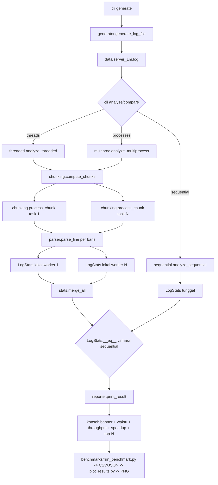

# DOKUMENTASI — Parallel Log File Analyzer

**Zheka Baila Arkan (247006111152)** — UTS Komputasi Paralel dan Terdistribusi,
Informatika FT, Universitas Siliwangi. Dosen: Rohmat Gunawan, M.T.

Dokumen ini menjelaskan kode **apa adanya sesuai berkas yang benar-benar ada**
(dibaca ulang dari sumber), bukan rancangan yang tidak diimplementasikan.

---

## 1. Ringkasan Proyek dan Tujuan

Proyek ini menganalisis file log server berukuran besar (diuji sampai 1.000.000
baris / 89,5 MB) dan menghitung:

- jumlah baris per level (`INFO`, `DEBUG`, `WARNING`, `ERROR`);
- distribusi status code HTTP dan HTTP method;
- top-N IP address, top-N user, top-N path/endpoint;
- aktivitas pengguna per jam;
- statistik response time (rata-rata, maksimum, p95 berbasis histogram) dan total bytes;
- jumlah baris malformed.

Tujuan akademiknya bukan "membuat program tercepat", melainkan **membandingkan tiga
pendekatan eksekusi** pada pekerjaan yang sama:

| # | Pendekatan | Modul | Mekanisme |
|---|---|---|---|
| 1 | Sequential | `sequential.py` | satu loop streaming |
| 2 | Multithread | `threaded.py` | `ThreadPoolExecutor` + byte-range |
| 3 | Multiprocessing | `multiproc.py` | `ProcessPoolExecutor` + byte-range |

Hasil ketiganya dijamin **identik** (validasi otomatis di CLI, benchmark, dan 95
unit test); yang dibandingkan hanyalah waktunya. Perbedaan hasil inilah yang
mendemonstrasikan GIL, overhead komunikasi, dan Hukum Amdahl secara empiris.

**Keputusan teknis yang ditetapkan TASK.md dan dipatuhi:** Python 3.10+; pustaka
standar saja untuk logika inti (tambahan hanya `pytest`, `pytest-cov`, `matplotlib`);
nama fungsi/variabel/class berbahasa Inggris, docstring/komentar/output berbahasa
Indonesia; wajib cross-platform (semua entri multiprocessing dilindungi
`if __name__ == "__main__":`, fungsi worker top-level agar picklable saat `spawn` di
Windows, semua path memakai `pathlib`); **memory-friendly** (file tidak pernah dibaca
utuh ke memori, kecuali pada bug demo yang memang memperlihatkan akibatnya); dan
**reproducible** (seluruh keacakan memakai `random.Random(seed)`, default `42`).

---

## 2. Struktur Direktori

```
parallel-log-file-analyzer/
├── TASK.md                         Instruksi tugas asli (dari dosen/soal).
├── README.md                       Cara install & menjalankan (versi singkat).
├── DOKUMENTASI.md                  Dokumen ini: penjelasan lengkap per file/fungsi.
├── requirements.txt                pytest, pytest-cov, matplotlib.
├── pyproject.toml                  Konfigurasi minimal `pip install -e .` (src layout).
├── pytest.ini                      testpaths=tests, pythonpath=src, addopts=-q.
├── .gitignore                      mengabaikan .venv, __pycache__, data/*.log (results/ tidak).
├── src/
│   └── log_analyzer/
│       ├── __init__.py             Ekspor konstanta identitas + __version__.
│       ├── config.py               Identitas, regex acuan tercompile, konstanta.
│       ├── generator.py            Generator log dummy reproducible.
│       ├── parser.py               parse_line(): baris -> dict record | None.
│       ├── stats.py                Class LogStats + merge_all() + top_n().
│       ├── chunking.py             compute_chunks(), iter_lines_in_range(), process_chunk().
│       ├── sequential.py           analyze_sequential(): baseline satu loop.
│       ├── threaded.py             analyze_threaded(): ThreadPoolExecutor.
│       ├── multiproc.py            analyze_multiprocess(): ProcessPoolExecutor.
│       ├── reporter.py             Banner, format angka, cetak ringkasan & speedup.
│       └── cli.py                  argparse: generate | analyze | compare.
├── bug_demo/
│   ├── buggy_race_condition.py     Bug 1: statistik global tanpa lock (bukti lost update).
│   ├── buggy_sync_overhead.py      Bug 2: satu lock per baris (lebih lambat dari seq).
│   └── buggy_comm_overhead.py      Bug 3: Queue per baris antar proses (6,6x lebih lambat).
├── benchmarks/
│   ├── run_benchmark.py            Matriks ukuran x worker, median 3x ulang, CSV/JSON.
│   └── plot_results.py             4 grafik PNG dari CSV (backend Agg, 200 dpi).
├── tests/
│   ├── conftest.py                 Fixture log 2.000 & 20.000 baris (session-scoped).
│   ├── test_generator.py           Jumlah baris, determinisme, rasio malformed, validasi.
│   ├── test_parser.py              Field valid, 10 kasus malformed, unicode.
│   ├── test_stats.py               Merge aljabar, top_n, p95, pickle, __eq__.
│   ├── test_chunking.py            Cakupan byte-range 1..16 chunk + edge case.
│   ├── test_equivalence.py         sequential == threads == processes.
│   └── test_cli.py                 Output wajib (nama, NIM, worker, waktu), exit code.
├── data/                           File log hasil generate (di-.gitignore).
│   ├── server_100k.log / server_500k.log / server_1m.log
│   └── bug_race.log / bug_sync.log / bug_comm.log
├── results/
│   ├── benchmark_results.csv       Hasil benchmark (kolom sesuai spesifikasi TASK.md).
│   ├── benchmark_results.json      Versi JSON + konfigurasi + info mesin.
│   ├── machine_info.json           Spesifikasi mesin saat pengukuran.
│   ├── cli_output_1m_sequential.txt / cli_output_1m_processes.txt / cli_compare_1m.txt
│   ├── bug_evidence/               3 transkrip eksekusi bug + bug_evidence.json.
│   └── charts/                     waktu_vs_thread.png, waktu_vs_process.png,
│                                   speedup_vs_konfigurasi.png, bug_vs_final.png
└── laporan/
    ├── LAPORAN.md                  Laporan template UTS bagian A-D (angka nyata).
    ├── UTS_247006111152_ZhekaBailaArkan.pdf
    └── gambar/                     arsitektur.png (dibuat matplotlib) + arsitektur.mmd.
```

---

## 3. Alur Data End-to-End



Ringkas: **generate → (chunking byte-range) → worker parse & agregasi lokal → merge →
validasi ekuivalensi → report → benchmark/grafik**.

---

## 4. Penjelasan Kode per File Sumber

### 4.1 `src/log_analyzer/config.py`

**Tujuan:** satu tempat untuk identitas dan konstanta, agar tidak ada string
di-hardcode berulang (persyaratan TASK.md Bagian 0).

| Objek | Tanggung jawab |
|---|---|
| `APP_NAME`, `AUTHOR_NAME`, `AUTHOR_NIM`, `IDENTITY_TEXT` | identitas; dipakai `reporter.print_banner()` dan test CLI |
| `BANNER_WIDTH = 54` | lebar garis pemisah output |
| `VALID_LEVELS` | frozenset level yang dikenal; penolakan level tak dikenal |
| `LOG_LINE_PATTERN` | regex acuan **satu-satunya**, di-compile sekali di modul ini |
| `MODES`, `DEFAULT_*`, `MAX_ALLOWED_WORKERS` | nilai default CLI dan batas validasi worker |
| `RT_BUCKET_WIDTH_MS = 25` | lebar bucket histogram response time |
| `LOG_ENCODING = "utf-8"` | encoding baca/tulis; decode memakai `errors="replace"` |

Blok penting — regex acuan (identik dengan yang ditetapkan soal, ditulis sebagai
string bertanda kutip tunggal agar tanda kutip ganda pada bagian `"METHOD path"`
tidak perlu di-escape):

```python
LOG_LINE_PATTERN = re.compile(
    r'^(?P<ts>\S+) \[(?P<level>[A-Z]+)\] '
    r'(?P<ip>\d{1,3}(?:\.\d{1,3}){3}) '
    r'(?P<user>\S+) '
    r'"(?P<method>[A-Z]+) (?P<path>\S+)" '
    r'(?P<status>\d{3}) (?P<bytes>\d+) (?P<rt>\d+)ms$'
)
```

Kompile sekali di level modul adalah syarat kinerja: bila `re.compile` atau
`re.match` dilakukan di dalam loop, parsing jutaan baris akan jauh lebih lambat.
Alasannya: setiap proses worker hanya membayar satu kali impor modul, bukan per baris.
Penamaan group (`ts`, `level`, `ip`, ...) membuat `parser.py` tidak perlu hafal indeks group.

### 4.2 `src/log_analyzer/parser.py`

**Tujuan:** mengubah satu baris menjadi record, tanpa pernah melempar exception.

- `extract_hour(timestamp: str) -> int | None` — mengambil jam dari indeks tetap
  string ISO (`ts[11:13]`) alih-alih `datetime.strptime`. Kompleksitas O(1).
  Alasan: `strptime` 1 juta kali menyumbang biaya CPU yang signifikan; kita hanya
  butuh jam, dan format sudah dijamin regex.
- `parse_line(line: str) -> dict | None` — O(1) per baris.
  Langkah: (1) buang `\n`/`\r`; (2) baris kosong → `None`; (3) `LOG_LINE_PATTERN.match`;
  (4) cek `level in VALID_LEVELS`; (5) `_ip_is_valid`; (6) `100 <= status <= 599`;
  (7) `bytes >= 0` dan `rt >= 0`; (8) `extract_hour`.
  Return: dict dengan kunci `ts, level, ip, user, method, path, status, bytes,
  response_ms, hour` — `status/bytes/response_ms/hour` sudah berupa int sehingga
  `stats` tidak mengonversi ulang.
- `_ip_is_valid(ip)` — cek tiap oktet 0–255. Regex acuan hanya memastikan pola digit
  (`\d{1,3}`), sehingga `999.1.1.1` tetap cocok. Validasi tambahan ini membuat IP
  tidak masuk akal benar-benar dihitung malformed, sekaligus menjaga generator
  (oktet selalu ≤255) tidak terpengaruh.

Mengapa dict dan bukan dataclass: lebih murah dibuat (jutaan objek), mudah di-`get`,
dan tidak perlu modul tambahan. Konsekuensi: tidak ada jaminan tipe statis pada
record — diterima karena pemakainya hanya `stats.add_record`.

### 4.3 `src/log_analyzer/stats.py`

**Tujuan:** agregat hasil analisis yang aman digabung antar worker.

Field: `total_lines`, `malformed_lines`, `parsed_lines`, tujuh counter
(`level_counts`, `status_counts`, `method_counts`, `ip_counts`, `user_counts`,
`path_counts`, `hourly_counts`), `total_bytes`, `total_response_ms`,
`max_response_ms`, dan `rt_histogram`.

- `_bump(counter, key)` — `counter[key] = counter.get(key, 0) + 1`; satu baris
  dipanggil 7× per record.
- `add_record(record)` / `add_malformed()` / `add_lines(lines)` — pencatatan satu baris.
  `add_lines` mengimpor `parse_line` **di dalam fungsi** untuk memutus siklus impor
  (`stats` ← `chunking`, `parser` → tak bergantung pada `stats`).
- `merge(other) -> LogStats` — mengembalikan objek baru, **tidak** mengubah operand
  (dites di `test_merge_tidak_mengubah_operand`). Ada jalan cepat `if other.total_lines == 0:
  return self.copy()`. Counter digabung dengan penjumlahan; `max_response_ms` memakai
  `max`. Karena semua operasi bersifat aditif/max, merge **asosiatif & komutatif**, dan
  `LogStats()` kosong adalah identitas — inilah fondasi ekuivalensi hasil paralel.
- `copy()` — salinan dengan dict terpisah, agar merge tidak membuat efek samping.
- `to_dict()` — normalisasi key menjadi `str` dan **disortir** sebelum dibanding;
  membuat perbandingan antar mode tidak peka urutan penyisipan dict.
- `__eq__` / `__hash__` / `__repr__` — `__eq__` memakai `to_dict()`; `__eq__` dengan tipe
  lain mengembalikan `NotImplemented`.
- `average_response_ms()` — `total_response_ms / parsed_lines` (hanya baris valid).
- `p95_response_ms()` — estimasi dari histogram:
  ```python
  target_rank = math.ceil(P95_PERCENTILE * total)
  # telusuri bucket menaik sampai cumulative >= target_rank
  p95 = lower + RT_BUCKET_WIDTH_MS * position_in_bucket / (count + 1)
  ```
  Interpolasi dalam bucket membuat nilai tetap deterministik setelah merge dan
  kesalahan maksimumnya satu lebar bucket (25 ms). **Mengapa histogram, bukan list:**
  list jutaan nilai tidak bisa di-merge secara efisien, tidak picklable-murah, dan
  membuat objek worker membesar — padahal TASK.md melarang menyimpan list jutaan nilai.
- `merge_all(stats_list)` — fold kiri atas daftar agregat; `merge_all([])` = identitas.
- `top_n(counter, n)` — urutan deterministik: hitungan menurun, lalu key menaik.
  Angka diurutkan numerik, key non-numerik berdasarkan string (`order_key` mengembalikan
  tuple `(-count, kelas, key)`), sehingga `top_n({3:2, 10:2}, 2)` = `[(3,2),(10,2)]` dan
  status code 500 tidak tersortir "di tengah" seperti pada urutan string.

Kompleksitas: `add_record` O(1); `merge` O(k) dengan k = jumlah key unik (ratusan),
bukan O(jumlah baris) — inilah yang menjaga biaya reduce tetap murah.

### 4.4 `src/log_analyzer/chunking.py`

**Tujuan:** pembagian file dan langkah *map*.

- `compute_chunks(file_size, num_chunks) -> list[tuple[int,int]]` — O(num_chunks).
  ```python
  start = file_size * index // num_chunks
  end   = file_size * (index + 1) // num_chunks
  ```
  Rumus ini (bukan `step = size // n` lalu `i*step`) sengaja dipilih agar:
  (a) chunk terakhir selalu berakhir tepat di `file_size` — tidak ada ekor file yang
  tak dimiliki siapa pun; (b) sisa pembagian tersebar merata, selisih ukuran antar
  chunk ≤ 1 byte; (c) `file_size = 0` tetap aman (semua rentang `(0,0)`);
  (d) `num_chunks > jumlah baris` tetap valid (chunk kosong menghasilkan agregat nol).
  Validasi: `file_size < 0` atau `num_chunks < 1` → `ValueError`.
- `iter_lines_in_range(path, start, end)` — generator, membuka file **mode biner**:
  ```python
  if end <= start: return
  if start > 0:
      handle.seek(start - 1); handle.readline()   # sinkron ke awal baris pertama milik chunk
  while True:
      position = handle.tell()
      if position >= end: break
      raw_line = handle.readline()
      if not raw_line: break
      yield raw_line.decode("utf-8", errors="replace").rstrip("\n").rstrip("\r")
  ```
  Aturan kepemilikan "byte pertama baris menentukan chunk" membuat rentang yang
  bersebelahan tidak mungkin saling menimpa. `errors="replace"` mencegah byte rusak
  menghentikan seluruh analisis; `rstrip` hanya membuang `\n`/`\r` (bukan `strip()`),
  agar spasi bermakna pada isi baris tidak berubah dan hasil sequential == paralel.
- `get_file_size(path)` — `os.path.getsize`; dipakai semua mode agar pembagian
  konsisten.
- `process_chunk(args)` — **top-level** (syarat pickle/spawn Windows): terima
  `(path, start, end)`, buka file sendiri, kembalikan `LogStats`. Yang melintasi batas
  proses hanya lintasan + 2 integer, bukan isi baris.
- `consume_line(stats, line)` — parse lalu `add_record`/`add_malformed`; dipakai juga
  oleh `sequential.py` supaya kedua jalur memperlakukan baris persis sama.

### 4.5 `src/log_analyzer/sequential.py`

`analyze_sequential(path) -> LogStats` — satu loop:
```python
with open(path, "rb") as handle:
    for raw_line in handle:
        consume_line(stats, raw_line.decode("utf-8", errors="replace"))
```
Iterasi objek file biner memecah hanya pada `b"\n"`, identik dengan `readline()` pada
worker, sehingga **tidak ada perbedaan definisi "baris"** antara baseline dan paralel.
Memori yang terpakai tetap O(1) per baris. O(n) waktu; kompleksitas sama dengan total
pekerjaan worker paralel, hanya saja pada satu core.

### 4.6 `src/log_analyzer/threaded.py`

`analyze_threaded(path, num_threads) -> LogStats`:
1. validasi `1 <= num_threads <= MAX_ALLOWED_WORKERS` (luar → `ValueError`);
2. `compute_chunks(get_file_size(path), num_threads)`;
3. buang rentang kosong (`end > start`) sehingga thread tidak ada yang menganggur;
4. file kosong → kembalikan `LogStats()` tanpa membuat pool;
5. `ThreadPoolExecutor(max_workers=len(tasks))` + `pool.map(process_chunk, tasks)`;
6. `merge_all(partial_results)` di thread utama.

**Tanpa lock.** Tidak ada state bersama selama fase map; satu-satunya titik tulis
bersama adalah merge yang terjadi setelah semua thread selesai. Ini perbaikan langsung
dari Bug 1 & Bug 2.

### 4.7 `src/log_analyzer/multiproc.py`

Struktur sama dengan `threaded.py`, hanya mengganti `ThreadPoolExecutor` →
`ProcessPoolExecutor`. Catatan penting:

- Worker `chunking.process_chunk` top-level dan argumennya tuple sederhana → picklable
  pada `spawn` (default Windows) maupun `fork` (Linux) / `spawn` (macOS Python ≥3.8).
- Yang dikirim: `(str(path), start, end)`; yang kembali: `LogStats` dengan beberapa
  ratus key. Payload per task ~puluhan byte, bukan puluhan kilobyte.
- `tasks` dihitung sebelum pool dibuat dan `max_workers=len(tasks)` mencegah pool
  lebih besar dari pekerjaan.
- Semua pemanggilan modul ini terjadi dari dalam fungsi yang dieksekusi lewat
  `cli.main()` di bawah `if __name__ == "__main__":` — perlindungan wajib `spawn`.

### 4.8 `src/log_analyzer/reporter.py`

**Tujuan:** satu tempat format output, sehingga identitas konsisten di semua jalur.

| Fungsi | Keterangan |
|---|---|
| `print_banner()` | cetak `=`×54, `PARALLEL LOG FILE ANALYZER`, `By ZHEKA BAILA ARKAN (247006111152)` |
| `format_int` / `format_seconds` | ribuan bergaya Indonesia: `f"{v:,}"` lalu koma→titik |
| `count_file_lines(path)` | penghitung baris streaming (mode biner), O(n) waktu O(1) memori |
| `print_chunk_plan(n)` / `print_worker_done(n)` | baris `[MULAI] membagi file menjadi N chunk` dan `[SELESAI] worker-1 … worker-N` |
| `print_result(...)` | banner (opsional), mode, jumlah worker, file, waktu total, throughput, speedup & efisiensi, lalu ringkasan statistik |
| `print_stat_summary(stats)` | level, top-5 status, method, top-5 IP/user/path, aktivitas per jam, rata-rata/maksimum/p95, total bytes |
| `speedup_ratio`, `efficiency_percent` | `T_seq/T_par` dan `speedup/worker×100` |

Throughput dihitung `total_lines / elapsed` (mencakup baris malformed, karena worker
membacanya juga).

### 4.9 `src/log_analyzer/cli.py`

Subcommand dan alur:

- `generate --lines --output --seed --malformed-ratio` → `print_banner()` lalu
  `generate_log_file()`.
- `analyze --input --mode --workers --top`:
  `sequential` langsung dilaporkan; `threads`/`processes` mencetak rencana chunk,
  menjalankan mode paralel, **lalu menjalankan sequential sebagai baseline internal**
  dan membandingkan `LogStats`. Bila berbeda → pesan error di stderr dan **kode exit 2**.
  Speedup/efisiensi ikut dicetak karena baseline tersedia.
- `compare --input --threads --processes --top`: menjalankan tiga mode, mencetak
  `Validasi ekuivalensi : IDENTIK (lulus)`, tabel markdown siap-tempel ke laporan
  (waktu, speedup, efisiensi, throughput), kemudian ringkasan statistik tiap mode.
  Kode exit 2 bila hasil tidak identik.
- Tipe argumen `positive_int`, `non_negative_int`, `ratio` menolak nilai tak masuk
  akal → argparse keluar dengan kode 2 (dites di `test_cli.py`).
- `InputError(ValueError)` dipakai untuk file tidak ada / bukan file biasa; `main()`
  menangkapnya → kode 1. `KeyboardInterrupt` → kode 130.

---

## 5. Penjelasan Setiap Bug di `bug_demo/`

Ketiga skrip berdiri sendiri, menambah `src` ke `sys.path`, melindungi entri dengan
`if __name__ == "__main__":`, menerima `--lines/--threads/--runs`, dan menyiapkan
file datanya sendiri bila belum ada. Bukti transkrip: `results/bug_evidence/`.

### 5.1 Bug 1 — `buggy_race_condition.py` (race condition)

- **Mekanisme:** satu objek `SharedCounters` dipakai semua thread; `record()` memecah
  `+= 1` menjadi read → modify → write memakai variabel sementara. Thread A membaca
  `total_lines`, thread B membaca nilai yang sama sebelum A menulis; keduanya menulis
  `x+1` sehingga satu increment hilang (*lost update*). Counter dict ikut terpengaruh.
- **Cara memicu:** `sys.setswitchinterval(1e-6)` memperkecil kuota waktu tiap thread,
  sehingga titik preemptive switch sering jatuh tepat di antara read dan write. Data
  50.000 baris, 4 thread, 10 percobaan.
- **Bukti nyata:** **10/10 percobaan salah**; rata-rata 2.304 baris hilang
  (terburuk 2.537, terbaik 2.142), ~4,7% undercount; jumlah ERROR hilang 175–216 baris.
- **Perbaikan di kode final:** tidak ada state bersama pada fase map — tiap worker
  memakai `LogStats` lokal dan merge dilakukan sekali di akhir (`threaded.py`,
  `multiproc.py`), sehingga race mustahil terjadi.

### 5.2 Bug 2 — `buggy_sync_overhead.py` (synchronization overhead)

- **Mekanisme:** "perbaikan" Bug 1 dengan `threading.Lock()` global yang
  di-acquire **per baris** (`with self.lock:` di dalam loop parsing).
- **Bukti nyata:** median 3 kali ulang, 100.000 baris: sequential 0,259 s vs 4 thread
  + lock 0,399 s → **1,54× lebih lambat** padahal hasilnya benar.
- **Analisis:** mutual exclusion memindahkan seluruh pekerjaan ke satu antrean —
  secara efektif tetap serial, ditambah dua biaya ekstra (opsi sistem akuisisi
  mutex dan hilangnya paralelisme memori/cache). Ini contoh bahwa "ada lock" bukan
  berarti "aman dan cepat"; lock yang terlalu halus (per baris) pada hot path adalah anti-pattern.
- **Perbaikan:** lokal-per-worker + merge (lihat 5.1); lock tidak ada sama sekali.

### 5.3 Bug 3 — `buggy_comm_overhead.py` (communication overhead)

- **Mekanisme:** proses utama `read_all_lines()` memuat seluruh file ke memori, lalu
  mengirim **satu baris per pesan** melalui `multiprocessing.Queue`; tiap pesan
  di-pickle, melewati pipe, dan di-unpickle oleh worker. Tersedia pula varian
  `split_to_batches()`/`count_raw_lines()` yang mengirim list string besar.
- **Bukti nyata:** median 3 kali ulang, 100.000 baris, 4 proses: naive 1,301 s vs
  final byte-range 0,197 s → **6,6× lebih lambat**; payload 10,3 MB vs 0,3 KB;
  hasil kedua versi identik.
- **Analisis:** dua kerugian sekaligus — volume data yang melintasi batas proses
  (seharusnya tidak ada) dan serialization round-trip 100.000 pesan kecil; selain itu
  worker tidak bisa mulai sebelum proses utama selesai membaca file (bottleneck serial
  di awal).
- **Perbaikan:** kirim hanya `(path, start, end)`; worker `process_chunk` membaca
  bagiannya sendiri dan mengembalikan agregat kecil.

---

## 6. Penjelasan Setiap Berkas Test

Menjalankan: `pytest -q` (95 test, ±20 detik; seluruh file uji memakai `tmp_path`
dengan 0–20.000 baris, sehingga < 60 detik) dan
`pytest --cov=log_analyzer --cov-report=term` → **95%**.

| Berkas | Apa yang diuji | Mengapa penting | Edge case |
|---|---|---|---|
| `conftest.py` | 2 fixture log (2.000 & 20.000 baris, session-scoped) | menghindari generate berulang antar test | — |
| `test_generator.py` (12 test) | jumlah baris untuk 0/1/1.000/20.000; seed sama → byte-identical; seed beda → beda; rasio malformed 0,3–0,8%; regex acuan; folder induk otomatis; `num_lines<0` & rasio>1 → `ValueError`; timestamp menaik | Generator adalah sumber data; determinisme = syarat reproducibility; jumlah baris meleset 1 saja membuat benchmark tidak adil | file 0 baris; direktori bertingkat; baris rusak jangan dihitung sebagai timestamp valid (dipakai `parse_line`, bukan regex mentah, karena beberapa template rusak tetap cocok regex) |
| `test_parser.py` (16 test) | tiap field record; newline akhir diabaikan; 10 variasi malformed → `None`; unicode/byte asing tidak crash; `extract_hour`; status 600 ditolak | Parser adalah gerbang semua statistik; satu exception di sini akan menghentikan jutaan baris | baris kosong, field hilang, `"get"` kecil, status `xyz`, level `CRITICAL`, IP `999.1.1`, `\udcff`, emoji |
| `test_stats.py` (13 test) | `add_record`/`add_malformed`/`add_lines`; merge komutatif & asosiatif; identitas `LogStats()`; merge tidak mengubah operand; `merge` tipe lain → `TypeError`; tie-break `top_n`; p95 hasil merge == hitung langsung (5.000 record acak seed 42); histogram per bucket; round-trip `pickle`; `__eq__`/`__repr__`; rata-rata & `top_hour` | **Fondasi ekuivalensi.** Kalau merge tidak asosiatif/komutatif, hasil paralel bergantung urutan worker dan tidak bisa dianggap benar | 0 record (p95/rata-rata/`top_hour` → 0/`None`); key campur angka-teks; dict key terurut-stabil |
| `test_chunking.py` (31 test) | cakupan penuh 1..16 chunk (tanpa duplikat/hilang) dengan membandingkan list baris persis; merge LogStats chunk == LogStats rentang penuh; `compute_chunks` menutupi `[0,size)` & bersebelahan; validasi error; file kosong; satu baris; tanpa newline akhir; chunk(64) > baris(2); baris 50 KB melintasi batas; byte tidak valid → U+FFFD | Kebenaran pembagian byte-range adalah inti paralelisasi I/O; bug di sini menghasilkan statistik salah yang **terlihat masuk akal** | semua kasus di kolom sebelumnya; `end<=start`; baris terakhir tanpa newline |
| `test_equivalence.py` (12 test) | `sequential == threads == processes` untuk workers 1/2/4; tiga mode identik pada 20.000 baris; konsistensi antar ulang; file kosong di tiga mode; workers 0/-1/5000 → `ValueError` | Ini "Definition of Done" proyek: hasil harus identik, bukan cuma mirip | file kosong; jumlah worker > jumlah baris; nilai worker tidak valid |
| `test_cli.py` (11 test) | `generate` membuat file + banner; tiap mode `analyze` memuat **"ZHEKA BAILA ARKAN"**, **"247006111152"**, label jumlah thread/proses, `Waktu total`, `Throughput`, jumlah worker; `compare` mencetak `IDENTIK (lulus)`, Speedup, Efisiensi; malformed terhitung; argumen tidak valid (mode salah, workers 0, lines −5, tanpa subcommand) → exit ≠ 0; file hilang / direktori → 1; `KeyboardInterrupt` → 130; `ValueError` → 1 | Menjamin persyaratan output wajib (identitas & metrik) benar-benar tampak di konsol, bukan hanya di objek internal | file tak ada, direktori sebagai input, mode paralel pada file 3 baris, pemetaan `_run` yang memancing exception |

Catatan khusus bug demo: bersifat **non-deterministik**, sehingga tidak ada test yang
mengassert race pasti terjadi. Bukti bug disimpan sebagai artefak eksekusi
(`results/bug_evidence/*.txt`) dan angka ringkasnya pada `bug_evidence.json`, bukan
sebagai assertion pytest.

---

## 7. Panduan Menjalankan

```bash
# 0. Lingkungan
python3 -m venv .venv && source .venv/bin/activate   # Windows: .venv\Scripts\activate
pip install -r requirements.txt
pip install -e .

# 1. Generate data
python -m log_analyzer.cli generate --lines 1000000 --output data/server_1m.log --seed 42
```
Contoh output (nyata):
```
======================================================
PARALLEL LOG FILE ANALYZER
By ZHEKA BAILA ARKAN (247006111152)
======================================================
[MULAI] membuat 1000000 baris log -> data/server_1m.log (seed=42)
  progress generate: 25% (250000/1000000 baris)
Selesai generate 1000000 baris -> data/server_1m.log dalam 6.52 detik
```

```bash
# 2. Analisis satu pendekatan
python -m log_analyzer.cli analyze --input data/server_1m.log --mode sequential
python -m log_analyzer.cli analyze --input data/server_1m.log --mode threads   --workers 4
python -m log_analyzer.cli analyze --input data/server_1m.log --mode processes --workers 4

# 3. Bandingkan tiga pendekatan
python -m log_analyzer.cli compare --input data/server_1m.log --threads 4 --processes 4

# 4. Bug demo + bukti
python bug_demo/buggy_race_condition.py --lines 50000 --threads 4 --runs 10
python bug_demo/buggy_sync_overhead.py  --lines 100000 --threads 4 --runs 3
python bug_demo/buggy_comm_overhead.py  --lines 100000 --processes 4 --runs 3

# 5. Benchmark & grafik
python benchmarks/run_benchmark.py                 # ukuran default 100k/500k/1M, worker 1/2/4/8
python benchmarks/run_benchmark.py --sizes 100000 500000 1000000 2000000 --repeats 3
python benchmarks/plot_results.py                  # results/charts/*.png

# 6. Test & cakupan
pytest -q
pytest --cov=log_analyzer --cov-report=term-missing
```

Contoh output `analyze --mode processes --workers 4` pada 1.000.000 baris (transkrip
tersimpan di `results/cli_output_1m_processes.txt`):

```
======================================================
PARALLEL LOG FILE ANALYZER
By ZHEKA BAILA ARKAN (247006111152)
======================================================
[MULAI] membagi file menjadi 4 chunk
[SELESAI] worker-1 worker-2 worker-3 worker-4
======================================================
Mode             : multiprocessing
Jumlah proses  : 4
File             : data/server_1m.log (1.000.000 baris, 89.472.259 byte)
------------------------------------------------------
Waktu total      : 2.897 detik
Throughput       : 345.200 baris/detik
Speedup          : 1.62x   Efisiensi: 40.5%
======================================================
```

Konversi laporan ke PDF: `laporan/UTS_247006111152_ZhekaBailaArkan.pdf` sudah dibuat
di mesin ini dengan **Google Chrome headless** (`--print-to-pdf`) dari HTML hasil
pustaka `markdown` (Python) + stylesheet CSS. Kedua alat itu bersifat *build tool
lokal*, bukan dependensi proyek, sehingga tidak dimasukkan ke `requirements.txt`.
Bila reader ingin mengulang sendiri:
`pandoc laporan/LAPORAN.md -o laporan/UTS_247006111152_ZhekaBailaArkan.pdf`, atau
buka `LAPORAN.md` di aplikasi Markdown lalu Print → Save as PDF.

---

## 8. Ringkasan Hasil Benchmark dan Keterbatasan

Median 3× ulang, 1× warm-up dibuang, Apple M1 8 core, 8 GB RAM, Python 3.14.4
(sumber: `results/benchmark_results.csv`):

| Ukuran data | Sequential | Thread terbaik | Proses terbaik |
|---|---|---|---|
| 100.000 | 0,316 s (1,00×) | 1 thread 0,363 s (0,87×) | 8 proses 0,289 s (1,09×) |
| 500.000 | 1,601 s (1,00×) | 1 thread 1,869 s (0,86×) | 8 proses 0,744 s (2,15×) |
| 1.000.000 | 3,183 s (1,00×) | 1 thread 3,725 s (0,85×) | 4 proses 1,498 s (2,12×, eff 53,1%) |

Temuan utama (penjelasan lengkap di `laporan/LAPORAN.md` bagian D):

1. **Multithread selalu ≤ 1,00×** — parsing regex adalah CPU-bound dan GIL membuat
   thread bergantian memegang satu core; menambah thread menambah biaya switch
   (8 thread pada 1M = 0,54×).
2. **Multiprocessing memberi 2,12–2,15×** dengan throughput naik dari ~314 rb ke
   ~670 rb baris/s; kurva jenuh setelah 4 proses.
3. **Overhead tetap ±0,6 s** (startup pool + merge) membuat data kecil (100 rb baris)
   tidak layak diparalelkan.
4. **Semua 24 konfigurasi paralel identik dengan sequential** — ditegakkan otomatis
   oleh benchmark (`RuntimeError`/kode exit berbeda bila tidak).

Keterbatasan:

- Data sintetis (bukan log produksi), meskipun distribusinya dibuat menyerupai
  spesifikasi (INFO 70%, WARNING 12%, ERROR 8%, DEBUG 10%; 0,5% malformed).
- Angka sangat bergantung mesin dan beban latar; variansi antar ulang terlihat pada
  thread-4/1M (5,532–10,635 s), karena itu median dipakai, dan angka mentah tetap
  tersedia di JSON.
- p95 berbasis histogram 25 ms → estimasi (kesalahan maksimum satu bucket), bukan nilai
  baris ke-N eksak; kompensasinya agregat kecil dan merge eksak.
- Dataset 2.000.000 baris tidak dijalankan pada pengukuran resmi (RAM 8 GB, waktu
  bench sudah ±4 menit); `--sizes` tersedia bila ingin menambah.
- Proses dan thread memakai jumlah chunk = jumlah worker (tanpa work stealing), sehingga
  chunk terlama menentukan waktu total.

---

## 9. Catatan Pengembangan Lanjutan (Opsional)

- **Dynamic chunking:** buat chunk lebih banyak daripada worker (mis. `4×num_workers`)
  dan pakai `as_completed` agar worker cepat membantu worker lambat; mengurangi dampak
  chunk terlama.
- **Streaming pipeline multiprocessing:** `imap_unordered` + chunksize agar merge
  berjalan bersamaan dengan map.
- **Format lain:** Apache/Nginx combined, JSON Lines, syslog RFC3164 — cukup tambah
  pola di `config.py` dan strategi `ParseStrategy` agar satu CLI bisa banyak format.
- **Mempercepat parsing:** ganti regex dengan `str.split` berindeks atau
  `re.finditer` per batch; alternatifnya pustaka `orjson`/`ujson` untuk format JSONL.
- **Grafik tambahan:** bar chart throughput, heatmap aktivitas per jam, dan
  *scalability curve* log-log.
- **Uji skalabilitas lintas mesin:** simpan `machine_info.json` sebagai bagian hasil
  agar laporan antar mesin dapat dibedakan secara jujur.
- **Quality of life:** `pyproject.toml` sudah ada, dapat dilanjutkan dengan `ruff` dan
  `mypy` (keduanya belum dipakai agar dependensi tetap sesuai ketentuan tugas).

---

## 10. Keputusan Desain yang Diambil Saat Ambigu

Sesuai aturan TASK.md Bagian 11 poin 6, pilihan di bawah adalah opsi paling sederhana
yang konsisten dengan dokumen tugas:

| Keputusan ambigu | Pilihan | Alasan singkat |
|---|---|---|
| Root proyek | direktori kerja ini diperlakukan sebagai root `uts-parallel-log-analyzer/` | `TASK.md` berada di root yang sama dan perintah dijalankan dari root |
| Record hasil parse | `dict` biasa | paling murah dibuat jutaan kali, tanpa modul tambahan |
| p95 | histogram bucket 25 ms + interpolasi linear | memenuhi larangan "list jutaan nilai" dan tetap eksak setelah merge |
| Import `parse_line` di `stats.py`/`chunking.py` | import lokal di dalam fungsi | memutus siklus impor tanpa membuat modul baru |
| Mode paralel pada `analyze` | selalu menjalankan sequential juga sebagai baseline | speedup/efisiensi diminta tampil; konsekuensi: satu `analyze` paralel memakan ±2× waktu |
| Jumlah chunk | = jumlah worker | sederhana, deterministik, tanpa work stealing |
| Baris dihitung `total_lines` | termasuk malformed; `parsed_lines` khusus yang valid | sesuai spesifikasi "jumlah baris malformed" |
| `results/*.png` | tidak di-ignore (hanya `data/*.log`) | mengikuti catatan `.gitignore` pada TASK.md |
| Validasi IP oktet ≤255 | ditambahkan di `parser.py` | regex acuan soal tidak boleh diubah, tetapi IP `999.x` jelas bukan data sahih |
| Konversi PDF | Chrome headless + python `markdown` sebagai build tool lokal | tidak menambah dependensi ke `requirements.txt` |
