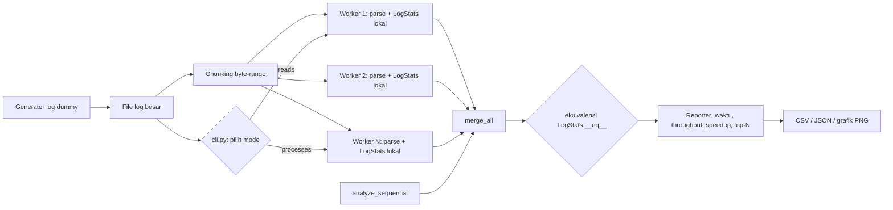

# LAPORAN UTS — Komputasi Paralel dan Terdistribusi

**Judul Proyek:** Parallel Log File Analyzer
**Tema:** Parallel Computing in Our Lives
**Nama:** Zheka Baila Arkan
**NPM:** 247006111152
**Program Studi:** Informatika, Fakultas Teknik, Universitas Siliwangi
**Dosen:** Rohmat Gunawan, M.T.
**Bahasa/Tools:** Python 3.14.4 (pustaka standar saja untuk logika inti), pytest, matplotlib

---

## A. Konsep dan Desain Solusi (20%)

### A.1 Deskripsi Singkat Proyek

File log server produksi menghasilkan jutaan baris per hari. Menganalisisnya secara
manual tidak mungkin, dan membacanya baris demi baris dalam satu loop terasa lambat
pada mesin multi-core masa kini (laptop ini memakai Apple M1 dengan 8 core).

**Parallel Log File Analyzer** menghitung ringkasan statistik file log berukuran
besar — jumlah per level, distribusi status code dan HTTP method, top-N IP/user/path,
aktivitas per jam, statistik response time (rata-rata, maksimum, p95), total bytes,
dan jumlah baris malformed — dengan **tiga pendekatan** yang dibandingkan secara
jujur di mesin yang sama:

1. **Sequential** — satu loop, sebagai baseline.
2. **Multithread** — `concurrent.futures.ThreadPoolExecutor`.
3. **Multiprocessing** — `concurrent.futures.ProcessPoolExecutor`.

Ketiga pendekatan **wajib menghasilkan statistik yang identik**; yang berbeda hanyalah
waktu penyelesaiannya. Perbedaan inilah yang menjadi objek percobaan, dan nilainya
relevan dengan materi kuliah: GIL membuat thread tidak mempercepat pekerjaan
CPU-bound, sedangkan proses bisa.

### A.2 Deskripsi Solusi untuk Tiga Pendekatan

**a) Pembagian pekerjaan: byte-range, bukan potongan list.**
File log tidak pernah dibaca utuh ke memori. Pekerjaan dibagi berdasarkan
*offset byte*, bukan berdasarkan isi baris:

```python
def compute_chunks(file_size, num_chunks):
    for index in range(num_chunks):
        start = file_size * index // num_chunks
        end = file_size * (index + 1) // num_chunks
        yield (start, end)          # rentang [start, end)
```

Aturan kepemilikan: **satu baris dimiliki oleh chunk tempat byte pertama baris itu
berada**. Karena rentang antar chunk berurutan, saling lepas, dan menutupi tepat
`[0, file_size)`, maka setiap baris dimiliki tepat satu chunk — tanpa duplikat dan
tanpa baris hilang, untuk jumlah chunk berapa pun (dibuktikan di `tests/test_chunking.py`
untuk 1..16 chunk, file kosong, satu baris, file tanpa newline akhir, baris panjang
yang melintasi batas byte, dan chunk yang lebih banyak daripada jumlah baris).

Sinkronisasi ke awal baris dilakukan dengan trik standar:

```python
if start > 0:
    handle.seek(start - 1)   # mundur satu byte
    handle.readline()        # baca dan BUANG baris yang dimiliki chunk sebelumnya
while True:
    position = handle.tell()
    if position >= end: break
    raw = handle.readline()
    ...
```

**b) Map-reduce tanpa lock.**
Setiap worker menjalankan `parse_line()` lalu mengisi **objek `LogStats` lokal**
miliknya sendiri (phase *map*). Tidak ada variabel bersama, sehingga tidak perlu lock
sama sekali pada hot path. Setelah semua worker selesai, proses/thread utama
menggabungkan agregat dengan `merge_all()` (phase *reduce*). Operasi merge dibuat
**asosiatif dan komutatif** dengan elemen identitas `LogStats()` kosong, sehingga
urutan penggabungan tidak memengaruhi hasil — inilah yang membuat hasil parallel
selalu sama persis dengan sequential.

**c) agregat yang kecil dan picklable.**
`LogStats` hanya menyimpan counter dan **histogram bucket response time** (lebar 25 ms),
bukan list jutaan angka. Akibatnya objek tetap kecil (ratusan entri) sehingga aman dan
murah dikirim antar proses, dan p95 dapat dihitung dari histogram dengan interpolasi
linear di dalam bucket.

**d) Perbedaan teknis antar pendekatan.**

| Aspek | Sequential | Multithread | Multiprocessing |
|---|---|---|---|
| Unit eksekusi | 1 loop | N thread (satu proses) | N proses (interpreter terpisah) |
| Pembagian kerja | tidak ada | byte-range | byte-range |
| Hasil worker | langsung ke 1 objek | `LogStats` lokal → merge di thread utama | `LogStats` di-pickle → merge di proses utama |
| Biaya tambahan | — | pembuatan thread + GIL | startup pool + pickle/unpickle |
| Batasan utama | CPU 1 core | GIL: regex tetap bergantian 1 core | memori & I/O, startup proses |

### A.3 Arsitektur Sistem


Sumber diagram (Mermaid) tersedia di `laporan/gambar/arsitektur.mmd`:



Alur data: **Input File Log → Chunking (byte-range) → Worker 1..N (parse + LogStats
lokal) → Merge → Hasil & Metrik**.

---

## B. Implementasi Kode (40%)

### B.1 Kode Versi Bug dan Buktinya

Tahap awal proyek ini sengaja memuat **tiga bug khas komputasi paralel**. Bukti di
bawah adalah output nyata eksekusi di mesin ini; transkrip lengkapnya disimpan pada
`results/bug_evidence/*.txt`.

#### Bug 1 — Race Condition (`bug_demo/buggy_race_condition.py`)

Cuplikan kode bermasalah — beberapa thread menulis ke statistik global **tanpa lock**,
dengan operasi dipecah menjadi *read → ubah → write*:

```python
def record(self, ip, is_error):
    current_total = self.total_lines          # READ
    current_errors = self.error_count         # READ
    current_ip = self.ip_counts.get(ip, 0)    # READ
    new_total = current_total + 1             # MODIFY
    new_errors = current_errors + (1 if is_error else 0)
    new_ip = current_ip + 1
    self.total_lines = new_total              # WRITE
    self.ip_counts[ip] = new_ip               # WRITE
    self.error_count = new_errors             # WRITE
```

`sys.setswitchinterval(1e-6)` dipakai agar jendela preemptive switch jatuh di antara
read dan write. Data 50.000 baris, 4 thread, 10 percobaan:

| Baseline sequential | total baris | baris ERROR |
|---|---|---|
| nilai benar | 50.000 | 4.011 |

| Percobaan | total terbaca | baris hilang | ERROR terbaca | ERROR hilang |
|---|---|---|---|---|
| run 1 | 47.606 | 2.394 | 3.830 | 181 |
| run 2 | 47.574 | 2.426 | 3.795 | 216 |
| run 4 | 47.463 | **2.537** (terburuk) | 3.824 | 187 |
| run 8 | 47.858 | 2.142 (terbaik) | 3.828 | 183 |
| run 10 | 47.779 | 2.221 | 3.818 | 193 |

**10 dari 10 percobaan salah.** Rata-rata ~2.300 baris hilang (**4,7%** hasil
undercount) dan ~190 baris ERROR hilang (~4,7%). Ini gejala *lost update*: dua thread
membaca nilai lama yang sama, lalu yang menulis terakhir menimpa hasil milik temannya.

#### Bug 2 — Synchronization Overhead (`bug_demo/buggy_sync_overhead.py`)

Perbaikan naif: satu `threading.Lock()` global yang dipegang **per baris**.

```python
def record(self, is_error):
    with self.lock:               # satu mutex untuk SETIAP baris
        self.total_lines += 1
        if is_error:
            self.error_count += 1
```

Data 100.000 baris, 4 thread, 3 kali ulang (median):

| Versi | waktu (s) | benar? |
|---|---|---|
| sequential tanpa lock | 0,259 | ya |
| 4 thread + lock per baris | **0,399** | ya |

Hasilnya **benar** (tidak ada update hilang), tetapi **1,54× lebih lambat daripada
sequential**, dan kecepatan bertambahnya nol meski thread empat kali lebih banyak:
seluruh thread mengantre pada mutex yang sama, sehingga pekerjaan justru berubah
menjadi serial ditambah biaya akuisisi lock.

#### Bug 3 — Communication Overhead (`bug_demo/buggy_comm_overhead.py`)

Versi multiprocessing naif: proses utama **membaca semua baris ke memori**, lalu
mengirim **satu baris per pesan** melalui `multiprocessing.Queue`.

Data 100.000 baris, 4 proses, 3 kali ulang (median):

| Versi | waktu (s) | payload antar proses |
|---|---|---|
| naive: Queue per baris | **1,301** | 10,3 MB |
| final: byte-range, worker baca sendiri | 0,197 | 0,3 KB |

Versi naif **6,6× lebih lambat**, padahal hasil akhirnya identik. Penyebabnya bukan
pickle besar saja, melainkan *jumlah pesan* (100.000 pesan kecil → 100.000×
serialisasi + sinkronisasi kanal) ditambah proses utama yang wajib membaca seluruh
file sebelum worker apa pun mulai bekerja.

### B.2 Kode Final dan Perbaikannya

**Perbaikan Bug 1 & 2 — statistik lokal per worker, merge sekali di akhir**
(tanpa lock di hot path):

```python
def process_chunk(args):                     # fungsi top-level: picklable
    path, start, end = args
    stats = LogStats()                       # LOKAL, tidak dibagi
    for line in iter_lines_in_range(path, start, end):
        consume_line(stats, line)
    return stats

def analyze_threaded(path, num_threads):
    chunks = compute_chunks(get_file_size(path), num_threads)
    with ThreadPoolExecutor(max_workers=len(tasks)) as pool:
        partial = list(pool.map(process_chunk, tasks))
    return merge_all(partial)                # merge terjadi SATU kali di akhir
```

**Perbaikan Bug 3 — yang dikirim hanya `(path, start, end)`, yang dikembalikan hanya
agregat kecil:**

```python
tasks = [(str(path), start, end) for start, end in chunks if end > start]
with ProcessPoolExecutor(max_workers=len(tasks)) as pool:
    partial = list(pool.map(process_chunk, tasks))   # ~30 byte per task
```

**Validasi otomatis** ada di dalam kode produksi, bukan hanya di test: `analyze`
membandingkan hasil parallel dengan hasil sequential dan keluar dengan kode error 2
bila berbeda; mode `compare` mencetak baris `Validasi ekuivalensi : IDENTIK (lulus)`.

### B.3 Contoh Output Nyata (1.000.000 baris)

```
======================================================
PARALLEL LOG FILE ANALYZER
By ZHEKA BAILA ARKAN (247006111152)
======================================================
[MULAI] membagi file menjadi 4 chunk
[SELESAI] worker-1 worker-2 worker-3 worker-4
======================================================
Mode             : multiprocessing
Jumlah proses    : 4
File             : data/server_1m.log (1.000.000 baris, 89.472.259 byte)
------------------------------------------------------
Waktu total      : 2.897 detik
Throughput       : 345.200 baris/detik
Speedup          : 1.62x   Efisiensi: 40.5%
======================================================
```

Cuplikan ringkasan statistik hasil eksekusi nyata pada file yang sama
(`results/cli_output_1m_sequential.txt`, mode sequential, waktu total 3,956 detik,
throughput 252.809 baris/detik):

```
Total baris      : 1.000.000
Baris malformed  : 5.037
Baris valid      : 994.963
Per level        : DEBUG 99.525 | ERROR 79.614 | INFO 696.396 | WARNING 119.428
Top-5 status     : 200 (521.536), 201 (83.261), 204 (75.926), 304 (58.983), 301 (56.215)
HTTP method      : GET 596.302 | POST 249.051 | PUT 80.044 | DELETE 49.650 | PATCH 19.916
Top-5 IP         : 41.213.115.199 (7.125), 47.149.219.1 (7.076), 66.119.13.144 (7.055)
Top-5 user       : user_113 (15.807), user_067 (15.442), user_126 (15.193)
Response time    : rata-rata 248,17 ms | maksimum 2.000 ms | p95 1.252,54 ms
Total bytes      : 24.925.814.718
```

Angka pada contoh eksekusi individual sedikit berbeda dari tabel benchmark karena
beban sistem lain pada saat pengukuran; semua mentahannya tersimpan pada
`results/cli_output_1m_processes.txt` dan `results/cli_compare_1m.txt`.

---

## C. Hasil Percobaan (25%)

### C.1 Spesifikasi Mesin

Diambil otomatis ke `results/machine_info.json`:

| Komponen | Nilai |
|---|---|
| Sistem operasi | macOS (Darwin, kernel 25.6.0), arsitektur arm64 |
| CPU | Apple M1 |
| Core fisik / logis | 8 / 8 |
| RAM | 8 GB |
| Python | 3.14.4 (CPython, GIL aktif) |
| Timer | `time.perf_counter()` |
| Metode agregasi | median dari 3 kali ulang, 1 kali warm-up dibuang |

Dataset dibuat **sebelum** pengukuran dan dipakai ulang oleh semua mode pada ukuran
yang sama (1.000.000 baris = 89,5 MB; sudah berada di page cache setelah pembacaan
pertama, sehingga biaya I/O awal file tidak mendominasi).

### C.2 Tabel Hasil Benchmark

Tabel lengkap (juga dicetak oleh `benchmarks/run_benchmark.py` dan disimpan pada
`results/benchmark_results.csv` / `.json`). Speedup dihitung terhadap median
sequential pada ukuran data yang sama.

| Jumlah data | Mode | Worker | Waktu (s) | Speedup | Efisiensi | Throughput (baris/s) |
|---|---|---|---|---|---|---|
| 100.000 | sequential | 1 | 0,316 | 1,00× | 100,0% | 316.587 |
| 100.000 | multithread | 1 | 0,363 | 0,87× | 87,1% | 275.754 |
| 100.000 | multithread | 2 | 0,416 | 0,76× | 38,0% | 240.281 |
| 100.000 | multithread | 4 | 0,478 | 0,66× | 16,5% | 209.212 |
| 100.000 | multithread | 8 | 0,814 | 0,39× | 4,8% | 122.880 |
| 100.000 | multiprocess | 1 | 0,501 | 0,63× | 63,0% | 199.611 |
| 100.000 | multiprocess | 2 | 0,369 | 0,86× | 42,9% | 271.320 |
| 100.000 | multiprocess | 4 | 0,341 | 0,93× | 23,2% | 293.565 |
| 100.000 | multiprocess | 8 | 0,289 | 1,09× | 13,7% | 346.489 |
| 500.000 | sequential | 1 | 1,601 | 1,00× | 100,0% | 312.217 |
| 500.000 | multithread | 1 | 1,869 | 0,86× | 85,7% | 267.451 |
| 500.000 | multithread | 2 | 2,072 | 0,77× | 38,6% | 241.286 |
| 500.000 | multithread | 4 | 2,514 | 0,64× | 15,9% | 198.890 |
| 500.000 | multithread | 8 | 3,507 | 0,46× | 5,7% | 142.590 |
| 500.000 | multiprocess | 1 | 1,947 | 0,82× | 82,3% | 256.870 |
| 500.000 | multiprocess | 2 | 1,121 | 1,43× | 71,4% | 446.089 |
| 500.000 | multiprocess | 4 | 0,753 | 2,13× | 53,2% | 663.904 |
| 500.000 | multiprocess | 8 | 0,744 | 2,15× | 26,9% | 672.225 |
| 1.000.000 | sequential | 1 | 3,183 | 1,00× | 100,0% | 314.155 |
| 1.000.000 | multithread | 1 | 3,725 | 0,85× | 85,5% | 268.492 |
| 1.000.000 | multithread | 2 | 4,109 | 0,77× | 38,7% | 243.367 |
| 1.000.000 | multithread | 4 | 6,974 | 0,46× | 11,4% | 143.391 |
| 1.000.000 | multithread | 8 | 5,939 | 0,54× | 6,7% | 168.368 |
| 1.000.000 | multiprocess | 1 | 3,821 | 0,83× | 83,3% | 261.680 |
| 1.000.000 | multiprocess | 2 | 2,256 | 1,41× | 70,6% | 443.333 |
| 1.000.000 | multiprocess | 4 | 1,498 | 2,12× | 53,1% | 667.403 |
| 1.000.000 | multiprocess | 8 | 1,492 | 2,13× | 26,7% | 670.296 |

**Validasi:** seluruh 24 konfigurasi paralel menghasilkan statistik **IDENTIK**
dengan sequential (ditegakkan oleh benchmark; bila berbeda, benchmark berhenti dengan
error).

### C.3 Grafik

| Grafik | Berkas |
|---|---|
| Waktu vs jumlah thread (+ baseline sequential) | `results/charts/waktu_vs_thread.png` |
| Waktu vs jumlah proses (+ baseline sequential) | `results/charts/waktu_vs_process.png` |
| Speedup thread & proses + garis ideal | `results/charts/speedup_vs_konfigurasi.png` |
| Bug demo vs kode final (tambahan) | `results/charts/bug_vs_final.png` |


---

## D. Analisis dan Kesimpulan (15%)

### D.1 Perbedaan Performa Antar Konfigurasi

1. **Multithread tidak pernah mengalahkan sequential.** Pada 1.000.000 baris, 1 thread
   sudah 0,85× (lebih lambat), dan bertambahnya thread membuat waktu **makin buruk**:
   0,77× → 0,64× → 0,46×. Ini persis perilaku yang diharapkan untuk beban CPU-bound
   di CPython: regex `parse_line()` adalah pekerjaan murni CPU, dan hanya satu thread
   yang boleh memegang GIL dalam satu waktu. Tambahan thread hanya menambah
   *context switch*, rebutan GIL, dan alokasi buffer per file, sehingga waktu
   bertambah tanpa ada paralelisme nyata.
2. **Multiprocessing memberi percepatan nyata, tetapi sub-linear.** Pada 1.000.000
   baris: 2 proses → 1,41×; 4 proses → 2,12×; 8 proses → 2,13× (nyaris tidak ada
   penambahan lagi). Throughput naik dari ~314 rb baris/s menjadi ~670 rb baris/s,
   yaitu **2,13 kali lipat**.
3. **Ukuran data menentukan apakah paralelisme menguntungkan.** Dengan 100.000 baris,
   seluruh mode paralel justru kalah atau baru seimbang (proses 8 worker = 1,09×):
   biaya *startup* pool (sekitar 0,2–0,6 detik) lebih besar daripada pekerjaan yang
   dipercepat. Pada 500.000 dan 1.000.000 baris barulah manfaatnya terlihat jelas
   (2,13–2,15×). Ini ilustrasi langsung dari *overhead tidak sebanding dengan
   granularity* — chunk yang terlalu kecil/pekerjaan terlalu pendek tidak layak
   diparalelkan.
4. **Anomali thread 8 vs thread 4** (0,54× vs 0,46× pada 1M) dan selisih antar ulang
   (mis. 10,635 s vs 5,532 s pada thread-4) adalah variansi scheduler macOS +
   proses lain di latar belakang; nilai yang dilaporkan adalah **median** untuk
   mengurangi pengaruhnya, dan angka mentah tiap ulang tersimpan pada JSON.

### D.2 Faktor Paling Berpengaruh

| Faktor | Peran pada proyek ini | Bukti |
|---|---|---|
| **GIL (CPU-bound regex parsing)** | Menghukum multithread | semua konfigurasi thread < 1,00×, memburuk seiring thread |
| **Overhead komunikasi & startup proses** | Menghukum data kecil dan pola kirim-baris | proses-1 = 0,83×; Bug 3 = 6,6× lebih lambat |
| **Biaya merge** | Kecil, tetapi serial di proses utama | agregat hanya ratusan entri counter; merge < 0,01 s |
| **I/O dan page cache** | Tidak dominan karena file sudah di cache; bacaan tiap worker tetap bersaing pada bandwidth memori | kecepatan melandai setelah 4 proses |

Dari sisi **Hukum Amdahl** `S(p) = 1 / ((1 - P) + P/p)`, kurva multiprocessing
menjalar dan praktis berhenti naik setelah 4 proses (2,12× → 2,13×). Bila bagian
yang benar-benar serial adalah `1 - P` dan diandaikan `p = 4` menghasilkan 2,12×,
maka `P ≈ 0,66` — artinya hanya sekitar dua pertiga waktu yang berhasil diparalelkan,
sekitar sepertiga sisanya terpakai oleh bagian serial (baca-then-setup, merge,
startup pool, dan biaya sinkronisasi internal `ProcessPoolExecutor`). Perlu dicatat
bahwa angka ini bukan *serial fraction* algoritmenya secara murni, karena sebagian
dari "bagian serial" adalah overhead mekanis CPython (pickle, manajemen pool), bukan
logika analisis. Model Amdahl dengan *overhead konstan* `C` lebih sesuai:
`S(p) = (T_seq) / (T_seq/p + C)`, dengan `C ≈ 0,6 s` — nilai itu konsisten dengan
selisih proses-1 (3,821 s) terhadap sequential (3,183 s) pada 1M baris.

### D.3 Mengapa Efisiensi Turun Saat Worker Melebihi Jumlah Core

Efisiensi didefinisikan `speedup / jumlah worker`. Pada 1M baris: 2 proses 70,6%,
4 proses 53,1%, 8 proses 26,7%. Penurunannya sebab:

- **Batas hardware.** Machine ini punya 8 core fisik; ketika worker melebihi core
  (atau melebihi jumlah *useful capacity* yang tersisa karena sistem memakai
  beberapa core untuk pekerjaan lain), worker berebut waktu CPU dan terjadi
  *context switching*, sehingga penambahan worker tidak menambah throughput.
- **Pembagian byte-range yang kaku.** `num_chunks = num_workers` berarti chunk kecil
  pada worker yang lebih lambat tidak dapat dibantu worker lain (tidak ada *work
  stealing*), sehingga waktu total = chunk terlama.
- **Overhead per worker yang konstan dan berulang.** Tiap proses baru membayar
  `spawn` interpreter, impor modul, dan pembuatan pipeline pickle. Dengan 8 proses,
  biaya tetap itu dikali delapan sementara pekerjaan yang diparalelkan sudah habis.
- **Amdahl.** Seiring `p` bertambah, `P/p` mengecil dan `(1-P)` menjadi dominan —
  speedup jenuh, efisiensi (`S/p`) otomatis turun cepat.

### D.4 Kesimpulan Umum

1. Untuk beban kerja **CPU-bound** seperti parsing regex jutaan baris pada CPython,
   **multiprocessing adalah pendekatan tercepat** (2,13× pada 8 core); **multithread
   tidak memberi kecepatan** dan bahkan memburuk seiring bertambahnya thread karena
   GIL. Pilihan "paralel = lebih cepat" tidak otomatis benar — jenis pekerjaannya
   menentukan pilihan mekanisme paralelisasi.
2. **Benar itu syarat, kecepatan itu Bonus.** Kesamaan hasil dijamin desain, bukan
   diuji kebetulan: kepemilikan baris berbasis byte pertama + merge asosiatif &
   komutatif + agregat lokal = hasil parallel identik sequential untuk jumlah worker
   berapa pun (diverifikasi otomatis pada CLI, benchmark, dan 95 unit test).
3. **Tiga bug paralel nyata terbukti lebih mahal daripada solusi final.** Race
   condition menghilangkan 4,7% hasil pada 10/10 percobaan; lock per baris membuat
   paralel 1,54× lebih lambat dari sequential; komunikasi per baris lewat Queue 6,6×
   lebih lambat dari kirim byte-range. Pola perbaikan yang sama untuk ketiganya:
   *minimalkan state bersama dan perkecil lalu-lintas pesan* (map lokal → reduce sekali).
4. **Paralelisme hanya layak di atas ambang ukuran tertentu.** Di bawah ±500 ribu
   baris overhead startup mendominasi; pada file kecil, sequential justru paling
   efisien. Untuk kehidupan sehari-hari ("Parallel Computing in Our Lives"):
   percepatan paralel baru terasa pada pekerjaan besar, dan biaya koordinasi harus
   diperhitungkan sebelum memutuskan jumlah worker.
5. Rekomendasi praktis pada mesin ini: **4 proses** (speedup 2,12× dengan efisiensi
   masih 53%) sebagai titik seimbang; 8 proses menambah hampir tidak ada kecepatan.

### D.5 Keterbatasan

- Dataset adalah log sintetis (reproducible, seed=42), bukan log produksi nyata.
- Hasil pengukuran bervariasi antar mesin/beban latar; angka laporan ini berlaku untuk
  Apple M1 / 8 core / macOS / Python 3.14.4 dan tidak dapat langsung dipindahkan.
- p95 dihitung dari histogram bucket 25 ms (estimasi, bukan nilai eksak baris ke-N),
  dengan konsekuensi kesalahan maksimum 25 ms; pilihan ini disengaja agar agregat
  tetap kecil dan dapat di-merge secara eksak.
- Benchmark tidak mengukur konsumsi daya/suhu; pada M1 throttling thermal dapat
  memengaruhi variansi angka.

---

## Lampiran: Rekap Unit Test

```
$ pytest -q --cov=log_analyzer --cov-report=term
TOTAL  612 statements  32 missed  95% coverage
```

| Berkas test | Yang dibuktikan |
|---|---|
| `tests/test_generator.py` | jumlah baris persis (0/1/1.000/20.000), byte-identical untuk seed sama, beda untuk seed beda, rasio malformed ≈ 0,5%, regex acuan, folder otomatis, argumen negatif ditolak, timestamp monotonik |
| `tests/test_parser.py` | 10 field terparse benar; baris kosong/field hilang/status huruf/level tak dikenal/IP rusak → `None` tanpa exception; unicode aneh tidak crash |
| `tests/test_stats.py` | merge komutatif & asosiatif, identitas kosong, tanpa efek samping, tie-break `top_n`, p95 hasil merge == hitung langsung, pickle, `__eq__` |
| `tests/test_chunking.py` | cakupan penuh 1..16 chunk tanpa duplikat/hilang, file kosong, 1 baris, tanpa newline akhir, chunk > jumlah baris, baris 50 KB melintasi batas byte |
| `tests/test_equivalence.py` | sequential == threads == processes (workers 1/2/4), konsistensi antar ulang, file kosong, jumlah worker tak valid ditolak |
| `tests/test_cli.py` | generate membuat file; tiap mode mencetak nama, NIM, jumlah worker, waktu total, throughput; compare melaporkan speedup; argumen tidak valid → exit ≠ 0 |

Berkas bukti: `results/bug_evidence/` (3 transkrip + JSON), `results/benchmark_results.csv`,
`results/benchmark_results.json`, `results/machine_info.json`, `results/charts/*.png`,
`results/cli_output_1m_processes.txt`, `results/cli_compare_1m.txt`.
