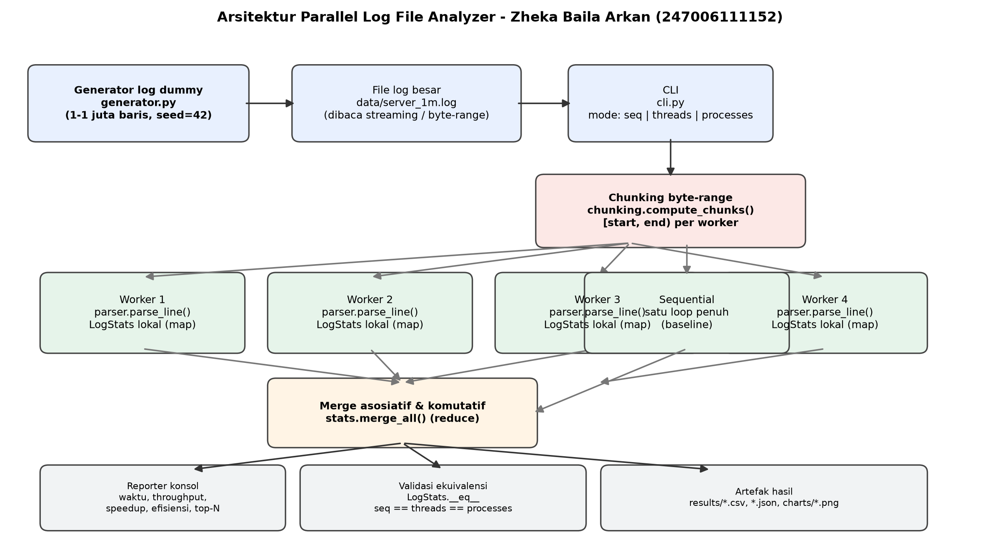
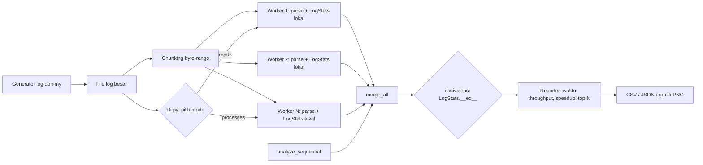
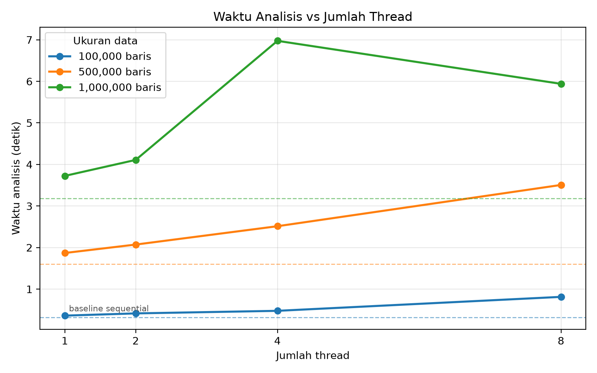
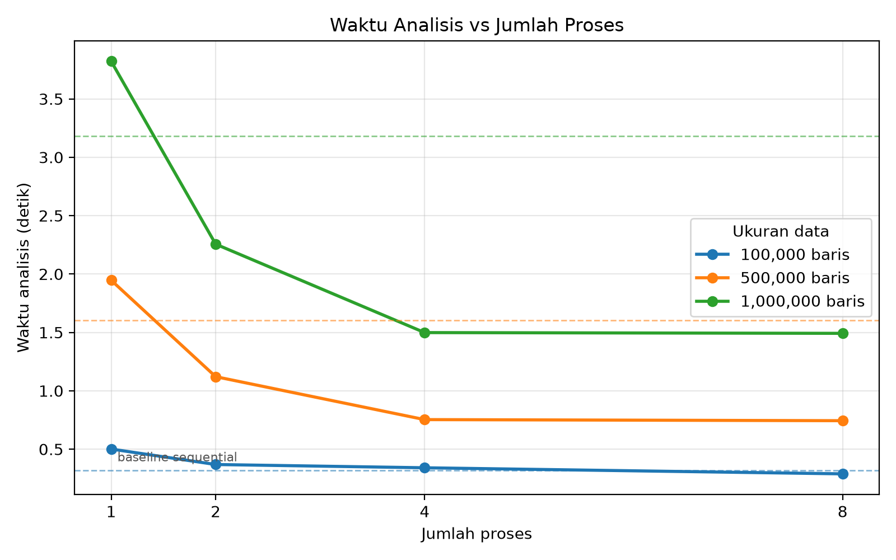
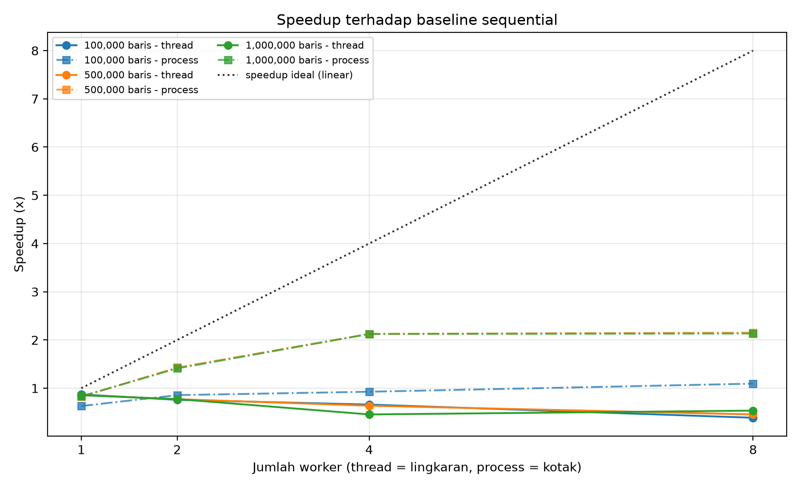

# LAPORAN UJIAN TENGAH SEMESTER

Komputasi Paralel dan Terdistribusi

Proyek Parallel Log File Analyzer

- Nama: Zheka Baila Arkan
- NPM: 247006111152
- Kelas: A
- Program Studi: Informatika, Fakultas Teknik, Universitas Siliwangi
- Mata Kuliah: Komputasi Paralel dan Terdistribusi (3 SKS)
- Dosen Pengampu: Rohmat Gunawan, M.T.
- Bahasa dan Perangkat: Python 3.14.4, pytest, dan matplotlib

## A. Konsep dan Desain Solusi

### A.1 Deskripsi Singkat Proyek

Berkas log pada server produksi dapat berisi jutaan baris setiap hari. Menganalisisnya secara manual tidak praktis, sedangkan membaca baris demi baris dalam satu perulangan terasa lambat pada komputer multi-core masa kini. Perangkat yang digunakan dalam percobaan ini adalah Apple M1 dengan 8 core.

*Parallel Log File Analyzer* adalah program yang menghitung ringkasan statistik dari berkas log berukuran besar. Statistik yang dihitung meliputi jumlah baris per level, sebaran *status code* dan metode HTTP, IP, pengguna, dan *path* teratas, aktivitas per jam, statistik waktu respons (rata-rata, maksimum, dan persentil ke-95), total *bytes*, serta jumlah baris yang tidak sesuai format (*malformed*). Perhitungan dilakukan dengan tiga pendekatan yang dibandingkan pada mesin yang sama, yaitu:

1. *Sequential*, yaitu satu perulangan tunggal yang menjadi pembanding dasar (*baseline*).
2. *Multithread*, menggunakan `concurrent.futures.ThreadPoolExecutor`.
3. *Multiprocessing*, menggunakan `concurrent.futures.ProcessPoolExecutor`.

Ketiga pendekatan tersebut harus menghasilkan statistik yang identik, sehingga yang berbeda hanyalah waktu penyelesaiannya. Perbedaan waktu inilah yang menjadi objek percobaan dan relevan dengan materi perkuliahan, yaitu *Global Interpreter Lock* (GIL) membuat *thread* tidak mempercepat pekerjaan yang terikat CPU (*CPU-bound*), sedangkan proses terpisah dapat mempercepatnya.

### A.2 Deskripsi Solusi untuk Tiga Pendekatan

a) Pembagian pekerjaan berdasarkan rentang *byte*, bukan potongan daftar. Berkas log tidak pernah dibaca utuh ke dalam memori. Pekerjaan dibagi berdasarkan *offset byte* dan bukan berdasarkan isi baris, seperti pada potongan kode berikut:

```python
def compute_chunks(file_size, num_chunks):
    for index in range(num_chunks):
        start = file_size * index // num_chunks
        end = file_size * (index + 1) // num_chunks
        yield (start, end)          # rentang [start, end)
```

Aturan kepemilikan baris adalah sebagai berikut: satu baris dimiliki oleh potongan (*chunk*) tempat *byte* pertama baris tersebut berada. Karena rentang antar-*chunk* berurutan, tidak saling tumpang tindih, dan menutupi tepat `[0, file_size)`, setiap baris dimiliki oleh tepat satu *chunk* tanpa duplikasi dan tanpa baris yang hilang, berapa pun jumlah *chunk*-nya. Hal ini dibuktikan pada `tests/test_chunking.py` untuk 1 sampai 16 *chunk*, berkas kosong, berkas satu baris, berkas tanpa baris baru di akhir, baris panjang yang melintasi batas *byte*, serta jumlah *chunk* yang lebih banyak daripada jumlah baris.

Penyelarasan ke awal baris dilakukan dengan teknik berikut:

```python
if start > 0:
    handle.seek(start - 1)   # mundur satu byte
    handle.readline()        # baca dan BUANG baris yang dimiliki chunk sebelumnya
while True:
    position = handle.tell()
    if position >= end: break
    raw = handle.readline()
    ...
```

b) Pola *map-reduce* tanpa kunci (*lock*). Setiap *worker* menjalankan `parse_line()` kemudian mengisi objek `LogStats` lokal miliknya sendiri (tahap *map*). Tidak ada variabel yang dipakai bersama sehingga *lock* tidak diperlukan sama sekali pada bagian kode yang paling sering dijalankan. Setelah seluruh *worker* selesai, *thread* atau proses utama menggabungkan agregat melalui `merge_all()` (tahap *reduce*). Operasi penggabungan dibuat bersifat asosiatif dan komutatif dengan elemen identitas berupa `LogStats()` kosong, sehingga urutan penggabungan tidak memengaruhi hasil. Sifat inilah yang membuat hasil pendekatan paralel selalu sama persis dengan hasil *sequential*.
c) Agregat yang kecil dan dapat di-*pickle*. `LogStats` hanya menyimpan penghitung (*counter*) dan histogram waktu respons dengan lebar *bucket* 25 ms, bukan daftar yang berisi jutaan angka. Dengan demikian ukuran objek tetap kecil (hanya ratusan entri) sehingga aman dan murah untuk dikirim antarproses. Persentil ke-95 dihitung dari histogram tersebut dengan interpolasi linear di dalam *bucket*.
d) Perbedaan teknis antarpendekatan dirangkum pada Tabel 1.

Tabel 1. Perbedaan teknis antara pendekatan *sequential*, *multithread*, dan *multiprocessing*

| Aspek | Sequential | Multithread | Multiprocessing |
|---|---|---|---|
| Unit eksekusi | Satu perulangan | N *thread* dalam satu proses | N proses dengan interpreter terpisah |
| Pembagian kerja | Tidak ada | Rentang *byte* | Rentang *byte* |
| Hasil *worker* | Langsung ke satu objek | `LogStats` lokal, digabung di *thread* utama | `LogStats` di-*pickle*, digabung di proses utama |
| Biaya tambahan | Tidak ada | Pembuatan *thread* dan GIL | *Startup pool* serta *pickle* dan *unpickle* |
| Batasan utama | Hanya memakai satu core CPU | GIL: ekspresi reguler tetap berjalan bergantian pada satu core | Memori, I/O, dan waktu *startup* proses |

### A.3 Arsitektur Sistem



Gambar 1. Arsitektur sistem *Parallel Log File Analyzer*

Sumber diagram (Mermaid) tersedia pada `laporan/gambar/arsitektur.mmd`:



Alur data pada sistem ini adalah sebagai berikut. Berkas log masuk ke tahap pembagian rentang *byte*, kemudian diproses oleh *worker* 1 sampai N yang masing-masing mem-*parse* baris dan membentuk `LogStats` lokal. Hasil seluruh *worker* lalu digabung menjadi hasil akhir beserta metrik kinerjanya.

## B. Implementasi Kode

### B.1 Kode Versi Bug beserta Buktinya

Tahap awal proyek ini sengaja memuat tiga *bug* yang lazim ditemui pada komputasi paralel. Bukti pada bagian ini merupakan keluaran nyata dari eksekusi di mesin yang sama, dan transkrip lengkapnya disimpan pada `results/bug_evidence/*.txt`.

#### B.1.1 Bug 1: Race Condition

Berkas yang digunakan adalah `bug_demo/buggy_race_condition.py`. Pada kode berikut, beberapa *thread* menulis ke statistik global tanpa *lock*, dengan operasi yang dipecah menjadi tahap baca, ubah, dan tulis:

```python
def record(self, ip, is_error):
    current_total = self.total_lines          # READ
    current_errors = self.error_count         # READ
    current_ip = self.ip_counts.get(ip, 0)    # READ
    new_total = current_total + 1             # MODIFY
    new_errors = current_errors + (1 if is_error else 0)
    new_ip = current_ip + 1
    self.total_lines = new_total              # WRITE
    self.ip_counts[ip] = new_ip               # WRITE
    self.error_count = new_errors             # WRITE
```

Fungsi `sys.setswitchinterval(1e-6)` digunakan agar pergantian *thread* secara *preemptive* terjadi di antara tahap baca dan tahap tulis. Percobaan dilakukan pada data 50.000 baris dengan 4 *thread* sebanyak 10 kali. Tabel 2 menampilkan lima percobaan yang mewakili, termasuk percobaan terburuk dan terbaik.

Tabel 2. Hasil percobaan *race condition* (4 *thread*, 50.000 baris)

| Percobaan | Total terbaca | Baris hilang | ERROR terbaca | ERROR hilang |
|---|---|---|---|---|
| Acuan (*sequential*) | 50.000 | 0 | 4.011 | 0 |
| Percobaan 1 | 47.606 | 2.394 | 3.830 | 181 |
| Percobaan 2 | 47.574 | 2.426 | 3.795 | 216 |
| Percobaan 4 | 47.463 | 2.537 (terburuk) | 3.824 | 187 |
| Percobaan 8 | 47.858 | 2.142 (terbaik) | 3.828 | 183 |
| Percobaan 10 | 47.779 | 2.221 | 3.818 | 193 |

Seluruh percobaan (10 dari 10) menghasilkan nilai yang salah. Rata-rata sekitar 2.300 baris hilang (sekitar 4,7% dari seluruh data) dan sekitar 190 baris ERROR hilang (sekitar 4,7% dari seluruh baris ERROR). Gejala ini disebut *lost update*, yaitu dua *thread* membaca nilai lama yang sama, kemudian *thread* yang menulis terakhir menimpa hasil milik *thread* lainnya.

#### B.1.2 Bug 2: Synchronization Overhead

Berkas yang digunakan adalah `bug_demo/buggy_sync_overhead.py`. Perbaikan yang bersifat naif adalah memakai satu `threading.Lock()` global yang dipegang pada setiap baris, seperti pada kode berikut:

```python
def record(self, is_error):
    with self.lock:               # satu mutex untuk SETIAP baris
        self.total_lines += 1
        if is_error:
            self.error_count += 1
```

Pengukuran dilakukan pada data 100.000 baris dengan 4 *thread* dan 3 kali pengulangan (nilai median). Hasilnya ditunjukkan pada Tabel 3.

Tabel 3. Perbandingan waktu pada percobaan *synchronization overhead*

| Versi | Waktu (s) | Hasil benar? |
|---|---|---|
| *Sequential* tanpa *lock* | 0,259 | Ya |
| 4 *thread* dengan *lock* per baris | 0,399 | Ya |

Hasilnya benar karena tidak ada pembaruan yang hilang, tetapi waktunya 1,54 kali lebih lama daripada *sequential*. Penambahan jumlah *thread* hingga empat kali lipat tidak menambah kecepatan sama sekali, karena seluruh *thread* mengantre pada *mutex* yang sama. Akibatnya pekerjaan berubah menjadi serial dan masih ditambah biaya untuk memperoleh *lock*.

#### B.1.3 Bug 3: Communication Overhead

Berkas yang digunakan adalah `bug_demo/buggy_comm_overhead.py`. Versi *multiprocessing* yang naif membaca seluruh baris ke dalam memori pada proses utama, kemudian mengirimkannya satu baris per pesan melalui `multiprocessing.Queue`.

Pengukuran dilakukan pada data 100.000 baris dengan 4 proses dan 3 kali pengulangan (nilai median), dengan hasil pada Tabel 4.

Tabel 4. Perbandingan waktu dan data antarproses pada percobaan *communication overhead*

| Versi | Waktu (s) | Data yang dikirim antarproses |
|---|---|---|
| Naif: *Queue* per baris | 1,301 | 10,3 MB |
| Final: rentang *byte*, *worker* membaca sendiri | 0,197 | 0,3 KB |

Versi naif 6,6 kali lebih lambat meskipun hasil akhirnya identik. Penyebabnya bukan hanya ukuran data yang di-*pickle*, tetapi juga jumlah pesan: 100.000 pesan kecil berarti 100.000 kali serialisasi dan sinkronisasi kanal. Selain itu, proses utama harus membaca seluruh berkas terlebih dahulu sebelum *worker* mana pun mulai bekerja.

### B.2 Kode Final dan Perbaikannya

#### B.2.1 Perbaikan Bug 1 dan Bug 2

Statistik dibuat lokal pada setiap *worker* dan digabung hanya satu kali di akhir, sehingga tidak ada *lock* pada bagian kode yang paling sering dijalankan:

```python
def process_chunk(args):                     # fungsi top-level: picklable
    path, start, end = args
    stats = LogStats()                       # LOKAL, tidak dibagi
    for line in iter_lines_in_range(path, start, end):
        consume_line(stats, line)
    return stats

def analyze_threaded(path, num_threads):
    chunks = compute_chunks(get_file_size(path), num_threads)
    with ThreadPoolExecutor(max_workers=len(tasks)) as pool:
        partial = list(pool.map(process_chunk, tasks))
    return merge_all(partial)                # merge terjadi SATU kali di akhir
```

#### B.2.2 Perbaikan Bug 3

Data yang dikirim ke *worker* hanya berupa `(path, start, end)`, dan data yang dikembalikan hanya berupa agregat kecil:

```python
tasks = [(str(path), start, end) for start, end in chunks if end > start]
with ProcessPoolExecutor(max_workers=len(tasks)) as pool:
    partial = list(pool.map(process_chunk, tasks))   # ~30 byte per task
```

#### B.2.3 Validasi Otomatis

Validasi dilakukan di dalam kode program, bukan hanya pada pengujian unit. Perintah `analyze` membandingkan hasil paralel dengan hasil *sequential* dan keluar dengan kode galat 2 apabila hasilnya berbeda, sedangkan mode `compare` mencetak baris `Validasi ekuivalensi : IDENTIK (lulus)`.

### B.3 Contoh Keluaran Program (1.000.000 Baris)

Berikut adalah keluaran program pada data 1.000.000 baris dengan mode *multiprocessing* menggunakan 4 proses:

```
======================================================
PARALLEL LOG FILE ANALYZER
By ZHEKA BAILA ARKAN (247006111152)
======================================================
[MULAI] membagi file menjadi 4 chunk
[SELESAI] worker-1 worker-2 worker-3 worker-4
======================================================
Mode             : multiprocessing
Jumlah proses    : 4
File             : data/server_1m.log (1.000.000 baris, 89.472.259 byte)
------------------------------------------------------
Waktu total      : 2.897 detik
Throughput       : 345.200 baris/detik
Speedup          : 1.62x   Efisiensi: 40.5%
======================================================
```

Ringkasan statistik hasil eksekusi nyata pada berkas yang sama (mode *sequential*, waktu total 3,956 detik, *throughput* 252.809 baris per detik) tersimpan pada `results/cli_output_1m_sequential.txt` dan ditampilkan sebagai berikut:

```
Total baris      : 1.000.000
Baris malformed  : 5.037
Baris valid      : 994.963
Per level        : DEBUG 99.525 | ERROR 79.614 | INFO 696.396 | WARNING 119.428
Top-5 status     : 200 (521.536), 201 (83.261), 204 (75.926), 304 (58.983), 301 (56.215)
HTTP method      : GET 596.302 | POST 249.051 | PUT 80.044 | DELETE 49.650 | PATCH 19.916
Top-5 IP         : 41.213.115.199 (7.125), 47.149.219.1 (7.076), 66.119.13.144 (7.055)
Top-5 user       : user_113 (15.807), user_067 (15.442), user_126 (15.193)
Response time    : rata-rata 248,17 ms | maksimum 2.000 ms | p95 1.252,54 ms
Total bytes      : 24.925.814.718
```

Angka pada contoh eksekusi tunggal sedikit berbeda dari tabel hasil *benchmark* karena adanya beban sistem lain saat pengukuran. Seluruh data mentahnya tersimpan pada `results/cli_output_1m_processes.txt` dan `results/cli_compare_1m.txt`.

## C. Hasil Percobaan

### C.1 Spesifikasi Mesin

Spesifikasi mesin diambil secara otomatis dan disimpan pada `results/machine_info.json`, seperti ditunjukkan pada Tabel 5.

Tabel 5. Spesifikasi mesin pengujian

| Komponen | Nilai |
|---|---|
| Sistem operasi | macOS (Darwin, kernel 25.6.0), arsitektur arm64 |
| CPU | Apple M1 |
| Jumlah core fisik dan logis | 8 dan 8 |
| RAM | 8 GB |
| Python | 3.14.4 (CPython, GIL aktif) |
| Timer | `time.perf_counter()` |
| Metode agregasi | Median dari 3 kali pengulangan, dengan 1 kali pemanasan (*warm-up*) yang dibuang |

Dataset dibuat sebelum pengukuran dimulai dan dipakai ulang oleh semua mode pada ukuran yang sama. Dataset 1.000.000 baris berukuran 89,5 MB dan sudah berada di *page cache* setelah pembacaan pertama, sehingga biaya I/O awal tidak mendominasi hasil pengukuran.

### C.2 Tabel Hasil Benchmark

Hasil lengkap *benchmark* dicetak oleh `benchmarks/run_benchmark.py` dan disimpan pada `results/benchmark_results.csv` serta `results/benchmark_results.json`. *Speedup* dihitung terhadap median *sequential* pada ukuran data yang sama, dan hasilnya ditunjukkan pada Tabel 6.

Tabel 6. Hasil *benchmark* untuk seluruh konfigurasi (median dari 3 kali pengulangan)

| Jumlah data | Mode | Jumlah worker | Waktu (s) | Speedup (kali) | Efisiensi | Throughput (baris/detik) |
|---|---|---|---|---|---|---|
| 100.000 | sequential | 1 | 0,316 | 1,00 | 100,0% | 316.587 |
| 100.000 | multithread | 1 | 0,363 | 0,87 | 87,1% | 275.754 |
| 100.000 | multithread | 2 | 0,416 | 0,76 | 38,0% | 240.281 |
| 100.000 | multithread | 4 | 0,478 | 0,66 | 16,5% | 209.212 |
| 100.000 | multithread | 8 | 0,814 | 0,39 | 4,8% | 122.880 |
| 100.000 | multiprocess | 1 | 0,501 | 0,63 | 63,0% | 199.611 |
| 100.000 | multiprocess | 2 | 0,369 | 0,86 | 42,9% | 271.320 |
| 100.000 | multiprocess | 4 | 0,341 | 0,93 | 23,2% | 293.565 |
| 100.000 | multiprocess | 8 | 0,289 | 1,09 | 13,7% | 346.489 |
| 500.000 | sequential | 1 | 1,601 | 1,00 | 100,0% | 312.217 |
| 500.000 | multithread | 1 | 1,869 | 0,86 | 85,7% | 267.451 |
| 500.000 | multithread | 2 | 2,072 | 0,77 | 38,6% | 241.286 |
| 500.000 | multithread | 4 | 2,514 | 0,64 | 15,9% | 198.890 |
| 500.000 | multithread | 8 | 3,507 | 0,46 | 5,7% | 142.590 |
| 500.000 | multiprocess | 1 | 1,947 | 0,82 | 82,3% | 256.870 |
| 500.000 | multiprocess | 2 | 1,121 | 1,43 | 71,4% | 446.089 |
| 500.000 | multiprocess | 4 | 0,753 | 2,13 | 53,2% | 663.904 |
| 500.000 | multiprocess | 8 | 0,744 | 2,15 | 26,9% | 672.225 |
| 1.000.000 | sequential | 1 | 3,183 | 1,00 | 100,0% | 314.155 |
| 1.000.000 | multithread | 1 | 3,725 | 0,85 | 85,5% | 268.492 |
| 1.000.000 | multithread | 2 | 4,109 | 0,77 | 38,7% | 243.367 |
| 1.000.000 | multithread | 4 | 6,974 | 0,46 | 11,4% | 143.391 |
| 1.000.000 | multithread | 8 | 5,939 | 0,54 | 6,7% | 168.368 |
| 1.000.000 | multiprocess | 1 | 3,821 | 0,83 | 83,3% | 261.680 |
| 1.000.000 | multiprocess | 2 | 2,256 | 1,41 | 70,6% | 443.333 |
| 1.000.000 | multiprocess | 4 | 1,498 | 2,12 | 53,1% | 667.403 |
| 1.000.000 | multiprocess | 8 | 1,492 | 2,13 | 26,7% | 670.296 |

Validasi: seluruh 24 konfigurasi paralel menghasilkan statistik yang identik dengan *sequential*. Hal ini ditegakkan oleh program *benchmark*, yang akan berhenti dengan pesan galat apabila terdapat perbedaan.

### C.3 Grafik Hasil Percobaan

Tiga grafik utama ditampilkan pada Gambar 2 sampai Gambar 4, sedangkan daftar seluruh berkas grafik terdapat pada Tabel 7.

Tabel 7. Daftar berkas grafik hasil percobaan

| Grafik | Berkas |
|---|---|
| Waktu terhadap jumlah *thread* (disertai *baseline sequential*) | `results/charts/waktu_vs_thread.png` |
| Waktu terhadap jumlah proses (disertai *baseline sequential*) | `results/charts/waktu_vs_process.png` |
| *Speedup* *thread* dan proses (disertai garis ideal) | `results/charts/speedup_vs_konfigurasi.png` |
| Perbandingan kode *bug* dan kode final (tambahan) | `results/charts/bug_vs_final.png` |



Gambar 2. Waktu eksekusi terhadap jumlah *thread*



Gambar 3. Waktu eksekusi terhadap jumlah proses



Gambar 4. *Speedup* terhadap konfigurasi

## D. Analisis dan Kesimpulan

### D.1 Perbedaan Performa Antar Konfigurasi

1. Pendekatan *multithread* tidak pernah mengungguli *sequential*. Pada 1.000.000 baris, penggunaan 1 *thread* saja sudah menghasilkan *speedup* 0,85 kali (lebih lambat), dan penambahan jumlah *thread* membuat waktu semakin buruk, yaitu 0,77 kali pada 2 *thread* dan 0,46 kali pada 4 *thread*. Hasil ini sesuai dengan perilaku yang diharapkan pada beban kerja yang terikat CPU di CPython: ekspresi reguler pada `parse_line()` adalah pekerjaan CPU murni, dan hanya satu *thread* yang dapat memegang GIL pada satu waktu. Penambahan *thread* hanya menambah pergantian konteks (*context switch*), perebutan GIL, dan alokasi *buffer* per berkas, sehingga waktu bertambah tanpa adanya paralelisme yang sebenarnya.
2. Pendekatan *multiprocessing* memberikan percepatan yang nyata, tetapi tidak linear (*sub-linear*). Pada 1.000.000 baris, *speedup* mencapai 1,41 kali dengan 2 proses, 2,12 kali dengan 4 proses, dan 2,13 kali dengan 8 proses (hampir tidak ada penambahan lagi). *Throughput* naik dari sekitar 314 ribu baris per detik menjadi sekitar 670 ribu baris per detik, atau 2,13 kali lipat.
3. Ukuran data menentukan apakah paralelisme menguntungkan. Pada 100.000 baris, seluruh mode paralel kalah atau baru setara dengan *sequential* (8 proses hanya mencapai 1,09 kali), karena biaya *startup pool* (sekitar 0,2 sampai 0,6 detik) lebih besar daripada pekerjaan yang dipercepat. Pada 500.000 dan 1.000.000 baris, manfaatnya baru terlihat jelas (2,13 sampai 2,15 kali). Hal ini menunjukkan bahwa *overhead* yang tidak sebanding dengan granularitas pekerjaan membuat pekerjaan yang terlalu kecil tidak layak diparalelkan.
4. Anomali antara 8 *thread* dan 4 *thread* (0,54 kali berbanding 0,46 kali pada 1.000.000 baris), serta selisih antar pengulangan (misalnya 10,635 detik berbanding 5,532 detik pada 4 *thread*), disebabkan oleh variasi penjadwal (*scheduler*) macOS dan proses lain yang berjalan di latar belakang. Nilai yang dilaporkan adalah median untuk mengurangi pengaruh tersebut, dan angka mentah setiap pengulangan tersimpan pada berkas JSON.

### D.2 Faktor yang Paling Berpengaruh

Faktor-faktor yang memengaruhi kecepatan program dirangkum pada Tabel 8.

Tabel 8. Faktor yang memengaruhi kecepatan program

| Faktor | Peran pada proyek ini | Bukti |
|---|---|---|
| GIL (*parsing* ekspresi reguler yang terikat CPU) | Merugikan kinerja *multithread* | Semua konfigurasi *thread* berada di bawah 1,00 kali dan memburuk seiring penambahan *thread* |
| *Overhead* komunikasi dan *startup* proses | Merugikan pada data kecil dan pada pola pengiriman per baris | Satu proses hanya mencapai 0,83 kali; *Bug* 3 lebih lambat 6,6 kali |
| Biaya penggabungan (*merge*) | Kecil, tetapi dikerjakan secara serial di proses utama | Agregat hanya berisi ratusan entri penghitung; waktu *merge* kurang dari 0,01 detik |
| I/O dan *page cache* | Tidak dominan karena berkas sudah berada di *cache*, tetapi pembacaan oleh setiap *worker* tetap bersaing pada *bandwidth* memori | Kecepatan melandai setelah 4 proses |

Berdasarkan Hukum Amdahl, *speedup* dirumuskan sebagai S(p) = 1 / ((1 - P) + P / p), dengan P adalah bagian pekerjaan yang dapat diparalelkan dan p adalah jumlah proses. Kurva *multiprocessing* praktis berhenti naik setelah 4 proses (dari 2,12 kali menjadi 2,13 kali). Jika pada p = 4 diperoleh *speedup* 2,12 kali, nilai P adalah sekitar 0,70. Artinya, sekitar 70% waktu berhasil diparalelkan dan sekitar 30% sisanya terpakai oleh bagian serial, yaitu pembacaan awal dan persiapan, penggabungan, *startup pool*, serta sinkronisasi internal `ProcessPoolExecutor`. Perlu dicatat bahwa angka ini bukan fraksi serial murni dari algoritmenya, karena sebagian dari bagian serial tersebut adalah *overhead* mekanis CPython (*pickle* dan pengelolaan *pool*), bukan logika analisis. Oleh karena itu, model Amdahl dengan *overhead* konstan C lebih sesuai, yaitu S(p) = Tseq / (Tseq / p + C), dengan C sekitar 0,6 detik. Nilai C tersebut konsisten dengan selisih waktu 1 proses (3,821 detik) terhadap *sequential* (3,183 detik) pada 1.000.000 baris.

### D.3 Penyebab Penurunan Efisiensi saat Jumlah Worker Bertambah

Efisiensi didefinisikan sebagai *speedup* dibagi jumlah *worker*. Pada 1.000.000 baris, efisiensi *multiprocessing* adalah 70,6% untuk 2 proses, 53,1% untuk 4 proses, dan 26,7% untuk 8 proses. Penurunan ini disebabkan oleh beberapa hal berikut:

- Keterbatasan perangkat keras. Mesin yang digunakan memiliki 8 core, sehingga pada 8 proses seluruh core terpakai dan tidak tersisa untuk sistem operasi maupun proses lain. Selain itu, Apple M1 terdiri atas 4 core performa dan 4 core efisiensi dengan kecepatan yang berbeda, sehingga core tambahan tidak memberikan kecepatan setara dengan core pertama. *Worker* yang berebut waktu CPU juga menimbulkan pergantian konteks, sehingga penambahan *worker* tidak menambah *throughput*.
- Pembagian rentang *byte* yang kaku. Jumlah *chunk* sama dengan jumlah *worker*, sehingga *worker* yang selesai lebih awal tidak dapat membantu *worker* yang masih bekerja (tidak ada *work stealing*). Akibatnya, waktu total ditentukan oleh *chunk* yang paling lama diselesaikan.
- *Overhead* tetap pada setiap *worker*. Setiap proses baru harus membuat interpreter (*spawn*), mengimpor modul, dan menyiapkan jalur *pickle*. Pada 8 proses, biaya tetap ini dikalikan delapan, sementara pekerjaan yang diparalelkan sudah hampir habis.
- Hukum Amdahl. Seiring bertambahnya p, nilai P / p mengecil sehingga bagian serial (1 - P) menjadi dominan. *Speedup* menjadi jenuh dan efisiensi (S / p) turun dengan cepat.

### D.4 Kesimpulan Umum

1. Untuk beban kerja yang terikat CPU, seperti *parsing* ekspresi reguler pada jutaan baris di CPython, *multiprocessing* adalah pendekatan tercepat (2,13 kali pada 8 core), sedangkan *multithread* tidak memberikan percepatan dan justru memburuk seiring bertambahnya *thread* akibat GIL. Anggapan bahwa paralel pasti lebih cepat tidak selalu benar, sebab jenis pekerjaan menentukan mekanisme paralelisasi yang tepat.
2. Ketepatan hasil merupakan syarat utama, sedangkan kecepatan adalah nilai tambah. Kesamaan hasil dijamin oleh rancangan, bukan kebetulan pengujian, yaitu melalui kepemilikan baris berdasarkan *byte* pertama, penggabungan yang asosiatif dan komutatif, serta agregat lokal. Dengan rancangan ini, hasil pendekatan paralel identik dengan *sequential* untuk jumlah *worker* berapa pun, dan hal itu diverifikasi secara otomatis pada CLI, *benchmark*, dan 95 pengujian unit.
3. Tiga *bug* paralel yang diuji terbukti lebih merugikan daripada solusi akhir. *Race condition* menghilangkan sekitar 4,7% hasil pada 10 dari 10 percobaan, *lock* per baris membuat versi paralel 1,54 kali lebih lambat daripada *sequential*, dan komunikasi per baris melalui *Queue* 6,6 kali lebih lambat daripada pengiriman rentang *byte*. Pola perbaikan ketiganya sama, yaitu meminimalkan *state* bersama dan memperkecil lalu lintas pesan (*map* secara lokal, lalu *reduce* satu kali).
4. Paralelisme hanya layak digunakan di atas ambang ukuran data tertentu. Di bawah sekitar 500 ribu baris, *overhead startup* mendominasi, dan pada berkas kecil *sequential* justru paling efisien. Dalam konteks tema "Parallel Computing in Our Lives", percepatan paralel baru terasa pada pekerjaan yang besar, dan biaya koordinasi harus diperhitungkan sebelum menentukan jumlah *worker*.
5. Rekomendasi praktis pada mesin ini adalah menggunakan 4 proses (*speedup* 2,12 kali dengan efisiensi 53%) sebagai titik keseimbangan, karena 8 proses nyaris tidak menambah kecepatan.

### D.5 Keterbatasan

- Dataset berupa log sintetis yang dapat direproduksi (*seed* 42), bukan log produksi yang sebenarnya.
- Hasil pengukuran dapat berbeda antar mesin dan beban latar belakang. Angka pada laporan ini hanya berlaku untuk Apple M1 dengan 8 core, macOS, dan Python 3.14.4, sehingga tidak dapat langsung dijadikan acuan pada lingkungan lain.
- Persentil ke-95 dihitung dari histogram dengan lebar *bucket* 25 ms, sehingga merupakan estimasi dan bukan nilai eksak pada baris ke-N, dengan galat maksimum 25 ms. Pilihan ini disengaja agar agregat tetap kecil dan dapat digabung secara eksak.
- *Benchmark* tidak mengukur konsumsi daya dan suhu. Pada M1, pembatasan kinerja akibat suhu (*thermal throttling*) dapat memengaruhi variasi angka.

## Lampiran. Rekapitulasi Pengujian Unit

Pengujian unit dijalankan dengan `pytest` dan menghasilkan cakupan kode sebesar 95%, seperti ditunjukkan pada keluaran berikut:

```
$ pytest -q --cov=log_analyzer --cov-report=term
TOTAL  612 statements  32 missed  95% coverage
```

Tabel 9. Ringkasan berkas pengujian unit dan hal yang dibuktikan

| Berkas pengujian | Hal yang dibuktikan |
|---|---|
| `tests/test_generator.py` | Jumlah baris tepat sesuai permintaan (0, 1, 1.000, dan 20.000); isi berkas identik *byte* demi *byte* untuk *seed* yang sama dan berbeda untuk *seed* yang berbeda; rasio baris *malformed* sekitar 0,5%; kesesuaian dengan ekspresi reguler acuan; pembuatan folder otomatis; penolakan argumen negatif; dan *timestamp* yang naik secara monotonik. |
| `tests/test_parser.py` | Sepuluh *field* terurai dengan benar; baris kosong, *field* hilang, status berupa huruf, level tidak dikenal, dan IP rusak menghasilkan `None` tanpa *exception*; karakter *unicode* yang tidak lazim tidak menyebabkan program berhenti. |
| `tests/test_stats.py` | Penggabungan bersifat komutatif dan asosiatif; elemen identitas berupa objek kosong; tidak ada efek samping; urutan seri pada `top_n` deterministik; persentil ke-95 hasil penggabungan sama dengan hasil hitung langsung; objek dapat di-*pickle*; dan `__eq__` bekerja dengan benar. |
| `tests/test_chunking.py` | Cakupan penuh untuk 1 sampai 16 *chunk* tanpa duplikasi maupun baris hilang; berkas kosong; berkas satu baris; berkas tanpa baris baru di akhir; jumlah *chunk* melebihi jumlah baris; dan baris sepanjang 50 KB yang melintasi batas *byte*. |
| `tests/test_equivalence.py` | *Sequential*, *threads*, dan *processes* menghasilkan hasil yang sama (jumlah *worker* 1, 2, dan 4); hasil konsisten antar pengulangan; berkas kosong; dan jumlah *worker* yang tidak valid ditolak. |
| `tests/test_cli.py` | Perintah `generate` membuat berkas; setiap mode mencetak nama, NPM, jumlah *worker*, waktu total, dan *throughput*; `compare` melaporkan *speedup*; argumen tidak valid menghasilkan *exit code* bukan nol. |